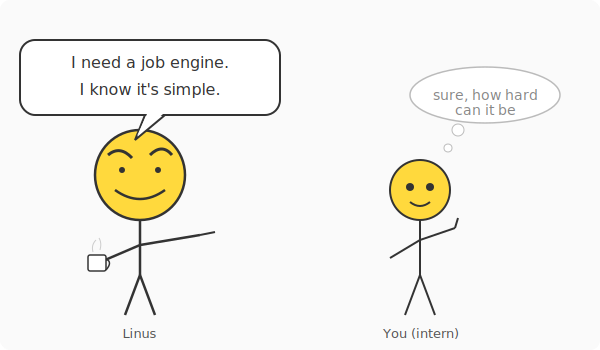
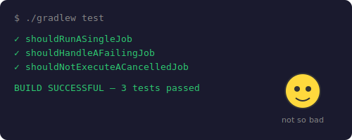

# Chapter 1: Your First Day — Build the Engine

[← Chapter 0: Prerequisites](part-00-prerequisites.md) | [Chapter 2: A Customer Gets Charged Twice →](part-02-race-conditions.md)

---

## The Task

It's your first week as an intern at a fintech startup. The team processes payments, sends notifications, generates reports — all as background jobs. Right now they're using a tangled mess of cron scripts and manual queue management.

Your tech lead, Linus — yes, everyone calls him that, and yes, he reviews every PR like it's a kernel patch — walks over to your desk. "We need a proper job engine. Something that accepts jobs and runs them. Start simple — we'll iterate. Think you can handle it?"

You nod. How hard can it be?



You grab a coffee, open your laptop, and start typing.

## Initialize the Project

```bash
mkdir job-engine && cd job-engine
```

Create `build.gradle`:

```groovy
plugins {
    id 'java'
    id 'org.springframework.boot' version '3.3.5'
    id 'io.spring.dependency-management' version '1.1.6'
}

group = 'com.jobengine'
version = '1.0.0'

java {
    toolchain {
        languageVersion = JavaLanguageVersion.of(21)
    }
}

repositories {
    mavenCentral()
}

dependencies {
    implementation 'org.springframework.boot:spring-boot-starter-web'
    implementation 'org.springframework.boot:spring-boot-starter-validation'

    testImplementation 'org.springframework.boot:spring-boot-starter-test'
    testRuntimeOnly 'org.junit.platform:junit-platform-launcher'
}

tasks.named('test') {
    useJUnitPlatform()
}
```

And `settings.gradle`:

```groovy
rootProject.name = 'job-engine'
```

Generate the Gradle wrapper so anyone can build without installing Gradle globally:

```bash
gradle wrapper --gradle-version 8.5
```

This creates `gradlew`, `gradlew.bat`, and the `gradle/wrapper/` directory. From here on, use `./gradlew` instead of `gradle`.

Spring Boot is just the container — the engine itself is pure Java. You wire up the main class and move on to the real work.

```java
// src/main/java/com/jobengine/JobEngineApplication.java
package com.jobengine;

import org.springframework.boot.SpringApplication;
import org.springframework.boot.autoconfigure.SpringBootApplication;

@SpringBootApplication
public class JobEngineApplication {
    public static void main(String[] args) {
        SpringApplication.run(JobEngineApplication.class, args);
    }
}
```

Alright, scaffolding done. Time to build the thing Linus actually asked for.

## The Job Model

A job needs three things: an identity, a status, and a task to run. That's it. No priority, no timeout, no dependencies — Linus said start simple.

### Status

A job is either waiting to run, running, done, or broken.

```java
// src/main/java/com/jobengine/model/JobStatus.java
package com.jobengine.model;

public enum JobStatus {
    PENDING,
    RUNNING,
    COMPLETED,
    FAILED
}
```

Four states. We'll add more later when we need them.

### The Job

```java
// src/main/java/com/jobengine/model/Job.java
package com.jobengine.model;

import java.time.Instant;

public class Job {

    private final String id;
    private final String name;
    private final Runnable task;

    // ⚠️ BUG: plain field — no thread safety
    private JobStatus status = JobStatus.PENDING;
    private Instant startedAt;
    private Instant completedAt;
    private String failureReason;

    public Job(String id, String name, Runnable task) {
        this.id = id;
        this.name = name;
        this.task = task;
    }

    // ⚠️ BUG: check-then-act is NOT atomic
    public boolean transitionTo(JobStatus expected, JobStatus next) {
        if (this.status == expected) {
            this.status = next;
            return true;
        }
        return false;
    }

    // Getters
    public String getId() { return id; }
    public String getName() { return name; }
    public Runnable getTask() { return task; }
    public JobStatus getStatus() { return status; }
    public Instant getStartedAt() { return startedAt; }
    public Instant getCompletedAt() { return completedAt; }
    public String getFailureReason() { return failureReason; }

    public void setStartedAt(Instant t) { this.startedAt = t; }
    public void setCompletedAt(Instant t) { this.completedAt = t; }
    public void setFailureReason(String r) { this.failureReason = r; }
}
```

An id, a name, a `Runnable` task, and a status that transitions through the lifecycle. The `transitionTo()` method checks the current status before changing it — if the job is already RUNNING, a second call with `expected=PENDING` returns `false`.

This version has bugs. The `transitionTo()` check-then-act is not atomic, and the fields have no visibility guarantees across threads. We'll discover both in production and fix them in Chapters 2 and 3.

## The Job Engine

The engine takes a job and runs it. No threads, no queues. Just execute.

```java
// src/main/java/com/jobengine/engine/JobEngine.java
package com.jobengine.engine;

import com.jobengine.model.Job;
import com.jobengine.model.JobStatus;

import java.time.Instant;

public class JobEngine {

    /**
     * Execute a job synchronously. No threading — just run it.
     * We'll add queues, workers, and concurrency in later chapters.
     */
    public void execute(Job job) {
        if (!job.transitionTo(JobStatus.PENDING, JobStatus.RUNNING)) {
            return; // already running or done
        }

        job.setStartedAt(Instant.now());

        try {
            job.getTask().run();
            job.transitionTo(JobStatus.RUNNING, JobStatus.COMPLETED);
        } catch (Exception e) {
            job.transitionTo(JobStatus.RUNNING, JobStatus.FAILED);
            job.setFailureReason(e.getMessage());
        }

        job.setCompletedAt(Instant.now());
    }
}
```

Simple: transition to RUNNING, run the task, mark COMPLETED or FAILED.

## Verify It Compiles

```bash
./gradlew build
```

Green. Now let's make sure it actually works.

## Smoke Tests

Two tests. One job that succeeds, one that fails.

```java
// src/test/java/com/jobengine/engine/JobEngineSmokeTest.java
package com.jobengine.engine;

import com.jobengine.model.Job;
import com.jobengine.model.JobStatus;
import org.junit.jupiter.api.Test;

import java.util.concurrent.atomic.AtomicBoolean;

import static org.assertj.core.api.Assertions.assertThat;

class JobEngineSmokeTest {

    @Test
    void shouldRunASingleJob() {
        JobEngine engine = new JobEngine();
        AtomicBoolean executed = new AtomicBoolean(false);

        Job job = new Job("1", "hello-world", () -> executed.set(true));

        engine.execute(job);

        assertThat(executed.get()).isTrue();
        assertThat(job.getStatus()).isEqualTo(JobStatus.COMPLETED);
        assertThat(job.getStartedAt()).isNotNull();
        assertThat(job.getCompletedAt()).isNotNull();
    }

    @Test
    void shouldHandleAFailingJob() {
        JobEngine engine = new JobEngine();

        Job job = new Job("2", "kaboom",
                () -> { throw new RuntimeException("Something broke"); });

        engine.execute(job);

        assertThat(job.getStatus()).isEqualTo(JobStatus.FAILED);
        assertThat(job.getFailureReason()).isEqualTo("Something broke");
    }
}
```

```bash
./gradlew test
```

All green. You lean back in your chair. That wasn't so bad.



You show Linus the green tests. He smiles. "Nice. Deploy it to staging."

You do. It works. For now.

But these tests only use one thread. The engine's `transitionTo()` check-then-act works perfectly when there's no contention. The bug only shows up when multiple threads call `execute()` on the same job at the same time — which is exactly what happens in production.

---

[← Chapter 0: Prerequisites](part-00-prerequisites.md) | [Chapter 2: A Customer Gets Charged Twice →](part-02-race-conditions.md)
