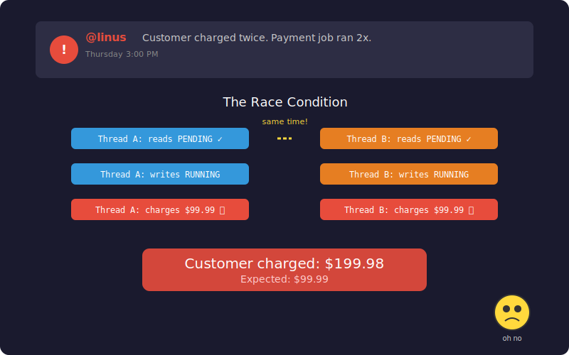

# Chapter 2: A Customer Gets Charged Twice

[← Chapter 1: Your First Day](part-01-project-setup.md) | [Chapter 3: The Dashboard Lies →](part-03-visibility.md)

---

## The Incident

Thursday, 3 PM. Slack lights up.

> **@linus:** We have a customer who got charged twice for the same order. Payment job ran two times. Can you look at the engine?

Linus never uses exclamation marks in Slack. When he does, someone's getting fired. This message has none, but you can feel the tension.

Your stomach drops. You check the logs.



Two worker threads picked up the same payment job at the same time. Both saw `status = PENDING`. Both transitioned to `RUNNING`. Both charged the customer.

Your single-threaded smoke tests never caught this. Time to figure out why.

## Why It Happened

Last week, Linus asked you to add threading so the engine could handle more load. You did the obvious thing:

```java
// This blocks for 5 seconds
engine.execute(slowJob);
// This has to wait — can't start until slowJob finishes
engine.execute(urgentJob);
```

If `slowJob` takes 5 seconds, `urgentJob` sits there doing nothing. With 100 jobs queued up, the last one waits for all 99 to finish. Your throughput is one job at a time, sequentially.

The obvious fix: use threads. Run jobs in parallel so a slow job doesn't block everything else.

```java
// Now they run concurrently
Thread t1 = new Thread(() -> engine.execute(slowJob));
Thread t2 = new Thread(() -> engine.execute(urgentJob));
t1.start();
t2.start();
```

You added threads to handle more load. But threads introduced a bug that doesn't exist in single-threaded code.

## Reproducing the Bug

Let's write a test that runs two threads through the engine on the same job. We expect the job to execute exactly once.

```java
// src/test/java/com/jobengine/engine/JobEngineRaceTest.java
package com.jobengine.engine;

import com.jobengine.model.Job;
import org.junit.jupiter.api.RepeatedTest;

import java.util.concurrent.atomic.AtomicInteger;

import static org.assertj.core.api.Assertions.assertThat;

class JobEngineRaceTest {

    /**
     * Two threads execute the same job through the engine.
     * We expect the task to run exactly once.
     *
     * @RepeatedTest because race conditions are timing-dependent.
     */
    @RepeatedTest(50)
    void jobShouldExecuteExactlyOnce() throws InterruptedException {
        AtomicInteger runCount = new AtomicInteger(0);
        JobEngine engine = new JobEngine();

        Job job = new Job("1", "payment", () -> runCount.incrementAndGet());

        Thread t1 = new Thread(() -> engine.execute(job));
        Thread t2 = new Thread(() -> engine.execute(job));

        t1.start();
        t2.start();
        t1.join();
        t2.join();

        assertThat(runCount.get()).isEqualTo(1); // FAILS — sometimes 2
    }
}
```

Run it:

```bash
./gradlew test --tests "com.jobengine.engine.JobEngineRaceTest"
```

It fails intermittently. Some runs pass, some don't:

```
expected: 1
 but was: 2
```

The job ran twice. In a payment system, that's a double charge.

## What Happened

Look at `transitionTo()` from Part 1:

```java
public boolean transitionTo(JobStatus expected, JobStatus next) {
    if (this.status == expected) {   // Thread A reads PENDING
        // ← Thread B also reads PENDING here (context switch)
        this.status = next;           // Thread A writes RUNNING
        return true;                  // Thread B also writes RUNNING
    }
    return false;
}
```

This is the classic **check-then-act** race condition. The `if` check and the `status = next` write are two separate operations. Between them, another thread can read the same value and also enter the block. Both threads see `PENDING`, both write `RUNNING`, both run the task.

## The Fix — AtomicReference with CAS

Replace the plain `JobStatus` field with an `AtomicReference` and use Compare-And-Swap (CAS).

First, add the two new statuses we'll need in later chapters:

```java
// src/main/java/com/jobengine/model/JobStatus.java
package com.jobengine.model;

public enum JobStatus {
    PENDING,
    RUNNING,
    COMPLETED,
    FAILED,
    CANCELLED,   // new — Chapter 2
    TIMED_OUT    // new — Chapter 6
}
```

Add a priority enum — we'll use it for queue ordering in Chapter 5:

```java
// src/main/java/com/jobengine/model/JobPriority.java
package com.jobengine.model;

public enum JobPriority {
    LOW(0), NORMAL(1), HIGH(2), CRITICAL(3);

    private final int weight;

    JobPriority(int weight) { this.weight = weight; }

    public int getWeight() { return weight; }
}
```

Now rewrite the `Job` class:

```java
// src/main/java/com/jobengine/model/Job.java
package com.jobengine.model;

import java.time.Duration;
import java.time.Instant;
import java.util.List;
import java.util.concurrent.atomic.AtomicReference;

public class Job implements Comparable<Job> {

    private final String id;
    private final String name;
    private final JobPriority priority;
    private final Duration timeout;
    private final Runnable task;
    private final List<String> dependsOn;

    // ✅ FIX: AtomicReference for lock-free CAS transitions
    private final AtomicReference<JobStatus> status = new AtomicReference<>(JobStatus.PENDING);
    private volatile Instant submittedAt;
    private volatile Instant startedAt;
    private volatile Instant completedAt;
    private volatile String failureReason;

    public Job(String id, String name, JobPriority priority, Duration timeout,
               Runnable task, List<String> dependsOn) {
        this.id = id;
        this.name = name;
        this.priority = priority;
        this.timeout = timeout;
        this.task = task;
        this.dependsOn = dependsOn != null ? List.copyOf(dependsOn) : List.of();
        this.submittedAt = Instant.now();
    }

    // ✅ FIX: CAS fuses check + write into one atomic CPU instruction
    public boolean transitionTo(JobStatus expected, JobStatus next) {
        return status.compareAndSet(expected, next);
    }

    public boolean cancel() {
        return status.compareAndSet(JobStatus.PENDING, JobStatus.CANCELLED);
    }

    // Getters
    public String getId() { return id; }
    public String getName() { return name; }
    public JobPriority getPriority() { return priority; }
    public Duration getTimeout() { return timeout; }
    public Runnable getTask() { return task; }
    public List<String> getDependsOn() { return dependsOn; }
    public JobStatus getStatus() { return status.get(); }
    public Instant getSubmittedAt() { return submittedAt; }
    public Instant getStartedAt() { return startedAt; }
    public Instant getCompletedAt() { return completedAt; }
    public String getFailureReason() { return failureReason; }

    public void setStartedAt(Instant t) { this.startedAt = t; }
    public void setCompletedAt(Instant t) { this.completedAt = t; }
    public void setFailureReason(String r) { this.failureReason = r; }

    /**
     * Priority ordering for PriorityBlockingQueue.
     * Higher priority = dequeued first.
     */
    @Override
    public int compareTo(Job other) {
        int cmp = Integer.compare(other.priority.getWeight(), this.priority.getWeight());
        if (cmp != 0) return cmp;
        return this.submittedAt.compareTo(other.submittedAt); // FIFO within same priority
    }
}
```

## How CAS Works


`compareAndSet(expected, next)` does this in a single CPU instruction:

1. Read the current value
2. Compare it to `expected`
3. If they match, write `next`
4. If they don't match, do nothing and return `false`

Steps 1-3 are **indivisible**. No thread can slip in between. If 100 threads race to transition PENDING → RUNNING, exactly one wins. The other 99 get `false`.

## The Test That Proves the Fix

Now run the same race with the fixed `Job`. This time, CAS guarantees exactly one winner — every single run, no exceptions.

```java
// src/test/java/com/jobengine/model/JobTest.java
package com.jobengine.model;

import org.junit.jupiter.api.Test;

import java.time.Duration;
import java.util.List;

import static org.assertj.core.api.Assertions.assertThat;

class JobTest {

    @Test
    void shouldStartAsPending() {
        Job job = new Job("1", "test", JobPriority.NORMAL, Duration.ofSeconds(5), () -> {}, null);
        assertThat(job.getStatus()).isEqualTo(JobStatus.PENDING);
    }

    @Test
    void shouldTransitionWithCAS() {
        Job job = new Job("1", "test", JobPriority.NORMAL, Duration.ofSeconds(5), () -> {}, null);

        assertThat(job.transitionTo(JobStatus.PENDING, JobStatus.RUNNING)).isTrue();
        assertThat(job.getStatus()).isEqualTo(JobStatus.RUNNING);

        // Can't transition from PENDING again (already RUNNING)
        assertThat(job.transitionTo(JobStatus.PENDING, JobStatus.RUNNING)).isFalse();
    }

    @Test
    void shouldCancelOnlyWhenPending() {
        Job job = new Job("1", "test", JobPriority.NORMAL, Duration.ofSeconds(5), () -> {}, null);
        assertThat(job.cancel()).isTrue();
        assertThat(job.getStatus()).isEqualTo(JobStatus.CANCELLED);

        // Can't cancel a running job via cancel()
        Job job2 = new Job("2", "test", JobPriority.NORMAL, Duration.ofSeconds(5), () -> {}, null);
        job2.transitionTo(JobStatus.PENDING, JobStatus.RUNNING);
        assertThat(job2.cancel()).isFalse();
    }

    @Test
    void shouldOrderByPriorityThenSubmissionTime() throws InterruptedException {
        Job low = new Job("1", "low", JobPriority.LOW, Duration.ofSeconds(5), () -> {}, null);
        Thread.sleep(10);
        Job high = new Job("2", "high", JobPriority.HIGH, Duration.ofSeconds(5), () -> {}, null);
        Thread.sleep(10);
        Job critical = new Job("3", "critical", JobPriority.CRITICAL, Duration.ofSeconds(5), () -> {}, null);

        assertThat(critical.compareTo(high)).isLessThan(0);   // critical before high
        assertThat(high.compareTo(low)).isLessThan(0);         // high before low
    }

    @Test
    void shouldHaveImmutableDependencies() {
        Job job = new Job("1", "test", JobPriority.NORMAL, Duration.ofSeconds(5), () -> {},
                List.of("dep1", "dep2"));
        assertThat(job.getDependsOn()).containsExactly("dep1", "dep2");
    }
}
```

```bash
./gradlew test --tests "com.jobengine.model.JobTest"
```

## Why Not `synchronized`?

You could do this:

```java
public synchronized boolean transitionTo(JobStatus expected, JobStatus next) { ... }
```

It works, but:
- `synchronized` acquires a lock — if the thread holding it gets paused, everyone waits
- CAS is **lock-free** — no thread can block another
- Under high contention (100+ threads), CAS scales better because there's no lock convoy

Use `synchronized` when you need to protect multiple operations together. Use CAS when you need a single atomic state change.

## What We Added

While fixing the race condition, we also expanded the `Job` class for what's coming next. The simple 3-field job from Chapter 1 grows up:

- `AtomicReference<JobStatus>` for lock-free status transitions — the actual fix
- `volatile` on mutable timestamp fields (we'll explain why in Part 3)
- `JobPriority` with weights — we'll use it for queue ordering in Part 5
- `Duration timeout` — we'll use it for stuck job detection in Part 6
- `List<String> dependsOn` — we'll use it for dependency resolution in Part 7
- `Comparable<Job>` for priority ordering (we'll use it in Part 5)
- `cancel()` method — CAS transition from PENDING to CANCELLED
- `CANCELLED` and `TIMED_OUT` added to `JobStatus` for future chapters

The constructor changes from `new Job(id, name, task)` to `new Job(id, name, priority, timeout, task, dependsOn)`. Every test from here on uses the full constructor.

You write the postmortem: "Double-execution caused by non-atomic status transition. Fixed with AtomicReference + CAS." Linus approves the fix. You deploy.

The double-charge bug is gone. But the next morning, the monitoring dashboard shows something weird...

---

[← Chapter 1: Your First Day](part-01-project-setup.md) | [Chapter 3: The Dashboard Lies →](part-03-visibility.md)
