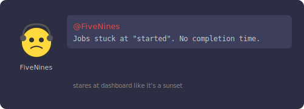

# Chapter 3: The Dashboard Lies

[← Chapter 2: A Customer Gets Charged Twice](part-02-race-conditions.md) | [Chapter 4: 3,000 Missing Metrics →](part-04-lost-increments.md)

---

## The Incident

Monday morning. You fixed the double-charge bug on Friday.



CAS is working — no more duplicate executions. But the ops team pings you:

> **@FiveNines:** The job dashboard shows some jobs stuck at "started" with no completion time. But the logs say they completed fine. Are the timestamps broken?

FiveNines is the ops guy. Real name unknown. He got the nickname because he once shut down a deploy at 4 AM because it dropped availability from 99.999% to 99.998%. He stares at dashboards the way normal people stare at sunsets.

You check the code. The worker thread sets `startedAt` and `completedAt`. The dashboard reads them from a different thread. The values are there in the logs... but the dashboard thread sometimes sees `null`.

The write happened. The other thread just can't *see* it.

## The Solution Attempt — Plain Fields

Here's what we had in Part 1:

```java
public class Job {
    private Instant startedAt;
    private Instant completedAt;
    private String failureReason;

    public void setStartedAt(Instant t) { this.startedAt = t; }
    public Instant getStartedAt() { return startedAt; }
    // ...
}
```

Plain fields. No synchronization. Looks fine — it's just a setter and a getter. What could go wrong?

## The Failing Test

This bug is notoriously hard to reproduce reliably in a test because it depends on CPU cache timing. But here's the scenario that fails in production:

```java
// This test demonstrates the SCENARIO — on some hardware/JVM configs,
// it will intermittently fail with plain (non-volatile) fields.
@Test
void threadBShouldSeeThreadAWrite() throws InterruptedException {
    Job job = new Job("1", "test", JobPriority.NORMAL,
            Duration.ofSeconds(5), () -> {}, null);

    // Thread A: set the timestamp
    Thread writer = new Thread(() -> {
        job.setStartedAt(Instant.now());
    });

    writer.start();
    writer.join();  // guarantee Thread A finished

    // Thread B: read the timestamp
    // With plain fields, this CAN return null on multi-core CPUs
    assertThat(job.getStartedAt()).isNotNull();
}
```

With `join()` providing a happens-before edge, this specific test usually passes. But in the real engine, there's no `join()` — the worker thread writes `startedAt` and a completely separate monitoring thread reads it at some arbitrary later point. Without a happens-before relationship, the JVM is allowed to serve a stale value.

Here's the more realistic scenario that breaks:

```java
// Worker thread (Core 1)              // Monitor thread (Core 2)
job.setStartedAt(Instant.now());       Instant t = job.getStartedAt();
                                       // t is null! Core 2 reads from
                                       // its own L1 cache, which still
                                       // has the old value
```

## What Happened


Modern CPUs don't share memory directly. Each core has its own L1/L2 cache:

```
Core 1                    Core 2
┌──────────┐              ┌──────────┐
│ L1 Cache │              │ L1 Cache │
│ startedAt│              │ startedAt│
│ = 10:30  │              │ = null   │  ← stale!
└────┬─────┘              └────┬─────┘
     │                         │
     └────────┬────────────────┘
              │
     ┌────────▼────────┐
     │   Main Memory   │
     │ startedAt = ???  │
     └─────────────────┘
```

When Thread A (on Core 1) writes `startedAt = Instant.now()`, the write goes into Core 1's L1 cache. It might not be flushed to main memory immediately. Thread B (on Core 2) reads `startedAt` from its own L1 cache, which still holds `null`.

This is the **Java Memory Model visibility problem**. Without explicit memory ordering, the JVM and CPU are free to:
- Keep writes in local caches indefinitely
- Reorder reads and writes for performance
- Serve stale values from store buffers

The JMM only guarantees visibility across threads when there's a **happens-before** relationship. Plain field writes don't establish one.

## The Fix — `volatile`

```java
public class Job {
    // ✅ volatile forces every write to flush to main memory
    // and every read to go to main memory (not local cache)
    private volatile Instant startedAt;
    private volatile Instant completedAt;
    private volatile String failureReason;

    public void setStartedAt(Instant t) { this.startedAt = t; }
    public Instant getStartedAt() { return startedAt; }
    // ...
}
```

`volatile` does two things:
1. **Writes are immediately visible** — a volatile write flushes the value to main memory (technically, it inserts a store barrier)
2. **Reads always see the latest write** — a volatile read goes to main memory (technically, it inserts a load barrier)

After the fix:

```
Core 1                    Core 2
┌──────────┐              ┌──────────┐
│ L1 Cache │              │ L1 Cache │
│ startedAt│              │ startedAt│
│ = 10:30  │  ──flush──►  │ = 10:30  │  ← up to date!
└────┬─────┘              └────┬─────┘
     │                         │
     └────────┬────────────────┘
              │
     ┌────────▼────────┐
     │   Main Memory   │
     │ startedAt=10:30 │
     └─────────────────┘
```

## What About `final` and `AtomicReference`?

Not every field needs `volatile`. Here's the rule:

| Field Type | Needs `volatile`? | Why |
|-----------|-------------------|-----|
| `final` fields (`id`, `name`, `priority`) | No | The JVM guarantees final fields are visible to all threads after construction |
| `AtomicReference<JobStatus> status` | No | Atomic classes use `volatile` internally — it's built in |
| Mutable fields written by one thread, read by another (`startedAt`, `completedAt`, `failureReason`) | **Yes** | No other mechanism provides visibility |

Look at our `Job` class from Part 2:

```java
private final String id;                              // final — safe
private final AtomicReference<JobStatus> status = ...; // volatile inside — safe
private volatile Instant startedAt;                    // volatile — safe
private volatile Instant completedAt;                  // volatile — safe
private volatile String failureReason;                 // volatile — safe
```

Every field has a visibility guarantee. No stale reads possible.

## The Test Passes

With `volatile` in place, Thread B always sees Thread A's write:

```java
@Test
void threadBShouldSeeThreadAWrite() throws InterruptedException {
    Job job = new Job("1", "test", JobPriority.NORMAL,
            Duration.ofSeconds(5), () -> {}, null);

    Thread writer = new Thread(() -> {
        job.setStartedAt(Instant.now());
    });

    writer.start();
    writer.join();

    // ✅ With volatile, this ALWAYS sees the write
    assertThat(job.getStartedAt()).isNotNull();
}
```

No new production code needed — we already added `volatile` in Part 2 when we fixed the `Job` class. This part explains *why* those `volatile` keywords are there.

## The Cost of `volatile`

`volatile` isn't free. Every volatile write forces a cache flush, and every volatile read bypasses the cache. On a tight loop with millions of reads, this matters. That's why we don't slap `volatile` on everything — only on fields that are written by one thread and read by another.

For our `Job` class, the timestamps are written once and read occasionally. The cost is negligible.

## Key Takeaway

| Problem | Symptom | Fix |
|---------|---------|-----|
| Race condition (Part 2) | Two threads both execute the job | `AtomicReference` + CAS |
| Visibility (Part 3) | Thread B reads stale/null value | `volatile` |

Race conditions are about *who wins*. Visibility is about *who sees what*. They're different bugs with different fixes, and you need both.

You explain the fix to FiveNines. He nods slowly. "So the dashboard was reading stale cache values from a different CPU core?" Exactly.

Linus overhears. "While you're at it, can you add metrics? We need to know how many jobs we're processing." Sure. How hard can counting be?

---

[← Chapter 2: A Customer Gets Charged Twice](part-02-race-conditions.md) | [Chapter 4: 3,000 Missing Metrics →](part-04-lost-increments.md)