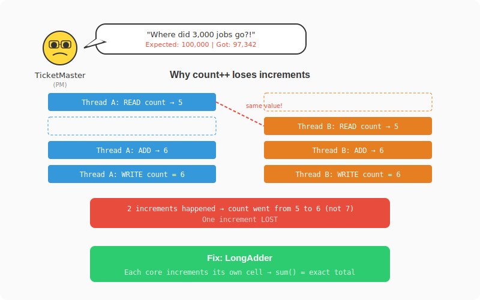

# Chapter 4: 3,000 Missing Metrics

[← Chapter 3: The Dashboard Lies](part-03-visibility.md) | [Chapter 5: The Fraud Alert That Came Too Late →](part-05-priority-inversion.md)

---

## The Incident

Linus asked for metrics. You added a simple counter.


`submitted++` every time a job comes in. You deploy it. The next day, the product manager pulls up the dashboard in a meeting:

> **@TicketMaster:** "The dashboard says we processed 97,342 jobs yesterday. But billing shows 100,000 transactions. Where did 3,000 jobs go?"

TicketMaster is the PM. She creates Jira tickets faster than you can close them. Legend has it she once filed a bug report about a bug report. When the numbers don't match, she finds you.

They didn't go anywhere. They all ran. Your counter just lost 3,000 increments.

## The Solution Attempt — Plain `int` Counter

```java
public class NaiveMetrics {
    private int submitted = 0;
    private int completed = 0;
    private int failed = 0;

    public void recordSubmitted() { submitted++; }
    public void recordCompleted() { completed++; }
    public void recordFailed() { failed++; }

    public int getSubmitted() { return submitted; }
    public int getCompleted() { return completed; }
    public int getFailed() { return failed; }
}
```

Looks clean. Works perfectly in single-threaded tests. Let's throw 100 threads at it.

## The Failing Test

```java
@Test
void naiveCounterLosesIncrements() throws InterruptedException {
    // Simulating the naive approach with a plain int wrapper
    AtomicInteger counter = new AtomicInteger(0); // stand-in for plain int
    int[] naiveCounter = {0}; // actual plain int — NOT thread-safe

    int threads = 100;
    int incrementsPerThread = 1000;
    Thread[] workers = new Thread[threads];

    for (int i = 0; i < threads; i++) {
        workers[i] = new Thread(() -> {
            for (int j = 0; j < incrementsPerThread; j++) {
                naiveCounter[0]++; // BUG: not atomic
            }
        });
    }

    for (Thread t : workers) t.start();
    for (Thread t : workers) t.join();

    // Expected: 100,000
    // Actual: something like 97,342
    System.out.println("Expected: " + (threads * incrementsPerThread));
    System.out.println("Actual:   " + naiveCounter[0]);
    // This will almost certainly be LESS than 100,000
}
```

Run it a few times. You'll see numbers like 97,342... 98,105... 96,891. Never 100,000.

## What Happened



`count++` looks like one operation but compiles to three:

```
ILOAD  count    // 1. Read current value from memory
IADD   1        // 2. Add 1
ISTORE count    // 3. Write result back to memory
```

Between any of these steps, another thread can interleave:

```
Thread A: ILOAD count → reads 5
Thread B: ILOAD count → reads 5      ← same value!
Thread A: IADD → 6
Thread B: IADD → 6                   ← same result!
Thread A: ISTORE → writes 6
Thread B: ISTORE → writes 6          ← overwrites A's write!
```

Two increments happened. The counter only went up by 1. One increment is lost.

At scale (100 threads × 1000 increments), thousands of increments vanish. Your dashboard says 97,342 jobs submitted when the real number is 100,000. You're making decisions based on wrong data.

## The Fix — LongAdder for Write-Heavy Counters

```java
// src/main/java/com/jobengine/metrics/JobMetrics.java
package com.jobengine.metrics;

import java.util.concurrent.atomic.AtomicLong;
import java.util.concurrent.atomic.LongAdder;

public class JobMetrics {

    // LongAdder: stripes across CPU cores — zero contention on writes
    private final LongAdder submitted = new LongAdder();
    private final LongAdder completed = new LongAdder();
    private final LongAdder failed = new LongAdder();
    private final LongAdder cancelled = new LongAdder();
    private final LongAdder timedOut = new LongAdder();
    private final LongAdder totalProcessingTimeMs = new LongAdder();

    // AtomicLong: for values that need exact point-in-time reads
    private final AtomicLong activeJobs = new AtomicLong(0);

    public void recordSubmitted() { submitted.increment(); }
    public void recordCompleted(long processingTimeMs) {
        completed.increment();
        totalProcessingTimeMs.add(processingTimeMs);
    }
    public void recordFailed() { failed.increment(); }
    public void recordCancelled() { cancelled.increment(); }
    public void recordTimedOut() { timedOut.increment(); }

    public void incrementActive() { activeJobs.incrementAndGet(); }
    public void decrementActive() { activeJobs.decrementAndGet(); }

    public long getSubmitted() { return submitted.sum(); }
    public long getCompleted() { return completed.sum(); }
    public long getFailed() { return failed.sum(); }
    public long getCancelled() { return cancelled.sum(); }
    public long getTimedOut() { return timedOut.sum(); }
    public long getActiveJobs() { return activeJobs.get(); }

    public double getAverageProcessingTimeMs() {
        long count = completed.sum();
        return count == 0 ? 0 : (double) totalProcessingTimeMs.sum() / count;
    }

    public void reset() {
        submitted.reset();
        completed.reset();
        failed.reset();
        cancelled.reset();
        timedOut.reset();
        activeJobs.set(0);
        totalProcessingTimeMs.reset();
    }
}
```

## How LongAdder Avoids the Problem

`LongAdder` internally maintains an array of cells — roughly one per CPU core. Each core increments its own cell. No two cores fight over the same memory location.

```
Core 1: cell[0] = 25,012
Core 2: cell[1] = 24,998
Core 3: cell[2] = 25,003
Core 4: cell[3] = 24,987
                            → sum() = 100,000 ✅
```

When you call `sum()`, it adds all cells together. The sum is eventually consistent (another thread might be mid-increment), but for counters like "total submitted" that's fine.

## LongAdder vs AtomicLong — When to Use Which

**AtomicLong** uses a single `volatile long` with CAS. Every thread contends on the same memory location. Under low contention it's fine, but under high contention it creates a CAS retry storm.

| Use Case | Pick | Why |
|----------|------|-----|
| Write-heavy counter (submitted, completed) | `LongAdder` | Scales with core count |
| Need exact point-in-time value (active jobs) | `AtomicLong` | `sum()` is eventually consistent |
| Need compareAndSet | `AtomicLong` | LongAdder doesn't support CAS |

We use `AtomicLong` for `activeJobs` because we need the exact count right now — "how many jobs are running at this instant?" For `submitted` and `completed`, we just need a running total that's accurate over time.

## The Test That Proves the Fix

```java
// src/test/java/com/jobengine/metrics/JobMetricsTest.java
package com.jobengine.metrics;

import org.junit.jupiter.api.Test;

import java.util.concurrent.CountDownLatch;
import java.util.concurrent.Executors;

import static org.assertj.core.api.Assertions.assertThat;

class JobMetricsTest {

    @Test
    void shouldTrackBasicMetrics() {
        JobMetrics metrics = new JobMetrics();

        metrics.recordSubmitted();
        metrics.recordSubmitted();
        metrics.recordCompleted(100);
        metrics.recordFailed();

        assertThat(metrics.getSubmitted()).isEqualTo(2);
        assertThat(metrics.getCompleted()).isEqualTo(1);
        assertThat(metrics.getFailed()).isEqualTo(1);
        assertThat(metrics.getAverageProcessingTimeMs()).isEqualTo(100.0);
    }

    @Test
    void shouldTrackActiveJobs() {
        JobMetrics metrics = new JobMetrics();

        metrics.incrementActive();
        metrics.incrementActive();
        assertThat(metrics.getActiveJobs()).isEqualTo(2);

        metrics.decrementActive();
        assertThat(metrics.getActiveJobs()).isEqualTo(1);
    }

    @Test
    void shouldHandleConcurrentIncrements() throws InterruptedException {
        JobMetrics metrics = new JobMetrics();
        int threads = 100;
        int incrementsPerThread = 1000;
        CountDownLatch latch = new CountDownLatch(threads);

        try (var executor = Executors.newVirtualThreadPerTaskExecutor()) {
            for (int i = 0; i < threads; i++) {
                executor.submit(() -> {
                    for (int j = 0; j < incrementsPerThread; j++) {
                        metrics.recordSubmitted();
                    }
                    latch.countDown();
                });
            }
            latch.await();
        }

        // ✅ No lost updates — all 100,000 increments counted
        assertThat(metrics.getSubmitted()).isEqualTo((long) threads * incrementsPerThread);
    }

    @Test
    void shouldReset() {
        JobMetrics metrics = new JobMetrics();
        metrics.recordSubmitted();
        metrics.recordCompleted(50);
        metrics.incrementActive();

        metrics.reset();

        assertThat(metrics.getSubmitted()).isZero();
        assertThat(metrics.getCompleted()).isZero();
        assertThat(metrics.getActiveJobs()).isZero();
    }
}
```

```bash
./gradlew test --tests "com.jobengine.metrics.JobMetricsTest"
```

100 threads × 1,000 increments = exactly 100,000. Every single time. No lost increments.

You redeploy. TicketMaster checks the dashboard the next morning. "Numbers match now." She closes the ticket. Then opens a new one: "Add alerting when metrics drift > 0.1%." Classic TicketMaster.

But then the security team calls...

---

[← Chapter 3: The Dashboard Lies](part-03-visibility.md) | [Chapter 5: The Fraud Alert That Came Too Late →](part-05-priority-inversion.md)