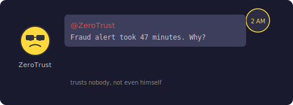

# Chapter 5: The Fraud Alert That Came Too Late

[← Chapter 4: 3,000 Missing Metrics](part-04-lost-increments.md) | [Chapter 6: The Stuck API Call →](part-06-thread-starvation.md)

---

## The Incident

It's 2 AM. Your phone buzzes. Slack.



> **@ZeroTrust:** A fraud alert job was submitted 47 minutes ago. It just executed. The attacker already drained the account. Why did it take 47 minutes?

ZeroTrust is the security engineer. He trusts nobody — not the users, not the network, not even his own code. He once rejected his own PR because "the author seems suspicious." When ZeroTrust pings you at 2 AM, something is very wrong.

You check the queue. There were 10,000 LOW priority log-cleanup jobs ahead of it. The fraud alert — marked CRITICAL — sat behind every single one. The queue is FIFO. First in, first out. Priority doesn't matter.

## The Solution Attempt — LinkedBlockingQueue (FIFO)

The obvious choice for a thread-safe queue:

```java
private final LinkedBlockingQueue<Job> queue = new LinkedBlockingQueue<>();

public void submit(Job job) {
    queue.offer(job);
}

// Worker pulls from queue
Job next = queue.poll(1, TimeUnit.SECONDS);
```

`LinkedBlockingQueue` is thread-safe, blocking, and simple. But it's strictly FIFO. Priority is ignored.

## The Failing Test

```java
@Test
void criticalJobShouldExecuteBeforeLowJob() throws InterruptedException {
    // Simulate a FIFO queue
    LinkedBlockingQueue<Job> fifoQueue = new LinkedBlockingQueue<>();

    Job low = new Job("1", "log-cleanup", JobPriority.LOW,
            Duration.ofSeconds(5), () -> {}, null);
    Job critical = new Job("2", "fraud-alert", JobPriority.CRITICAL,
            Duration.ofSeconds(5), () -> {}, null);

    // LOW submitted first, then CRITICAL
    fifoQueue.offer(low);
    fifoQueue.offer(critical);

    // Worker pulls next job
    Job first = fifoQueue.poll();

    // FAILS — FIFO returns LOW because it was submitted first
    assertThat(first.getPriority()).isEqualTo(JobPriority.CRITICAL);
}
```

```
expected: CRITICAL
 but was: LOW
```

The fraud alert is stuck behind the log cleanup. In a real system with thousands of LOW jobs queued, the CRITICAL job could wait minutes or hours.

## What Happened


FIFO queues have no concept of priority. They process elements in insertion order, period. It doesn't matter if the job is CRITICAL or LOW — whoever arrived first gets served first.

```
Queue (FIFO):
  [LOW] → [LOW] → [LOW] → ... 10,000 more ... → [CRITICAL]
                                                      ↑
                                              stuck at the back
```

This is the same problem that causes priority inversion in operating systems — a high-priority thread waiting on a low-priority thread that holds a resource.

## The Fix — PriorityBlockingQueue + Comparable

We already added `Comparable<Job>` in Part 2. Now we use it:

```java
// Replace LinkedBlockingQueue with PriorityBlockingQueue
private final PriorityBlockingQueue<Job> queue = new PriorityBlockingQueue<>();
```

`PriorityBlockingQueue` is a thread-safe min-heap. It dequeues the "smallest" element first. Our `compareTo` puts higher-weight jobs first (reversed comparison), so CRITICAL (weight=3) always comes out before LOW (weight=0):

```java
// From Job.java — already added in Part 2
@Override
public int compareTo(Job other) {
    int cmp = Integer.compare(other.priority.getWeight(), this.priority.getWeight());
    if (cmp != 0) return cmp;
    return this.submittedAt.compareTo(other.submittedAt); // FIFO within same priority
}
```

The second line matters: within the same priority level, jobs are ordered by submission time. The oldest NORMAL job runs before the newest NORMAL job. This prevents starvation among peers.

```
Queue (Priority Heap):
  [CRITICAL] → [HIGH] → [NORMAL] → [LOW] → [LOW] → ...
       ↑
  always dequeued first
```

## Why Not Just Sort the Queue?

- Sorting is O(n log n) on every insertion
- `PriorityBlockingQueue` uses a heap — O(log n) insert, O(log n) remove
- It's also thread-safe with built-in blocking for consumers (no busy-waiting)

## The Test That Proves the Fix

```java
@Test
void criticalJobShouldExecuteBeforeLowJob() throws InterruptedException {
    // ✅ PriorityBlockingQueue respects Comparable ordering
    PriorityBlockingQueue<Job> priorityQueue = new PriorityBlockingQueue<>();

    Job low = new Job("1", "log-cleanup", JobPriority.LOW,
            Duration.ofSeconds(5), () -> {}, null);
    Job critical = new Job("2", "fraud-alert", JobPriority.CRITICAL,
            Duration.ofSeconds(5), () -> {}, null);

    // LOW submitted first, then CRITICAL
    priorityQueue.offer(low);
    priorityQueue.offer(critical);

    // Worker pulls next job
    Job first = priorityQueue.poll();

    // ✅ PASSES — CRITICAL comes out first despite being submitted second
    assertThat(first.getPriority()).isEqualTo(JobPriority.CRITICAL);
    assertThat(first.getName()).isEqualTo("fraud-alert");
}
```

The fraud alert jumps to the front of the queue. Doesn't matter that 10,000 LOW jobs were submitted first — CRITICAL always wins.

We'll see this in action with the full engine in Part 10, where we block all workers, queue jobs in reverse priority order, then unblock and verify CRITICAL executes before LOW.

You deploy the fix. ZeroTrust tests it with a simulated fraud alert. It executes in under a second. "That's more like it." He still doesn't trust it, but that's just ZeroTrust being ZeroTrust.

But the next week, something else goes wrong. A job that calls an external API hangs for 10 minutes — and takes a worker thread with it...

---

[← Chapter 4: 3,000 Missing Metrics](part-04-lost-increments.md) | [Chapter 6: The Stuck API Call →](part-06-thread-starvation.md)