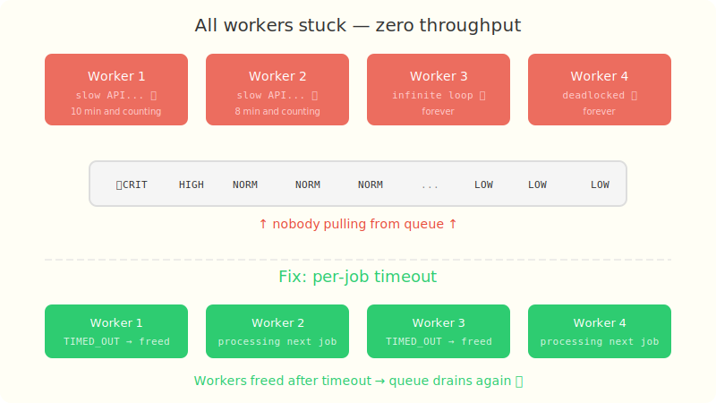

# Chapter 6: The Stuck API Call

[← Chapter 5: The Fraud Alert That Came Too Late](part-05-priority-inversion.md) | [Chapter 7: The Infinite Wait →](part-07-deadlocks.md)

---

## The Incident

Wednesday afternoon. The engine stops processing jobs. The queue is growing but nothing's executing. You check the workers — all 4 are alive but stuck.

> **@linus:** What's happening? We have 200 jobs in the queue and zero throughput.

No exclamation marks. Still terrifying.

You dig into the thread dump. All 4 workers are blocked inside `Thread.sleep()` — they're running jobs that call a third-party payment API, and that API is down. The jobs are waiting for a response that will never come. Every worker is hostage.

Your engine is alive but completely unresponsive.

## The Solution Attempt — No Timeout, Just Let It Run

The naive approach: trust that jobs will finish eventually.

```java
private void executeJob(Job job) {
    job.transitionTo(JobStatus.PENDING, JobStatus.RUNNING);
    job.setStartedAt(Instant.now());

    try {
        job.getTask().run();  // ← blocks until task finishes... whenever that is
        job.transitionTo(JobStatus.RUNNING, JobStatus.COMPLETED);
    } catch (Exception e) {
        job.transitionTo(JobStatus.RUNNING, JobStatus.FAILED);
    }

    job.setCompletedAt(Instant.now());
}
```

No timeout. No cancellation. If the task sleeps for 10 minutes, the worker sleeps for 10 minutes.

## The Failing Test

```java
@Test
void slowJobShouldNotHangForever() throws InterruptedException {
    // A job that sleeps for 10 seconds — simulating a hung API call
    Job job = new Job("1", "slow", JobPriority.NORMAL, Duration.ofMillis(200),
            () -> {
                try { Thread.sleep(10_000); }
                catch (InterruptedException e) { Thread.currentThread().interrupt(); }
            }, null);

    // Execute without timeout — just run the task directly
    Thread worker = new Thread(() -> {
        job.transitionTo(JobStatus.PENDING, JobStatus.RUNNING);
        job.setStartedAt(Instant.now());
        job.getTask().run();  // blocks for 10 seconds!
        job.transitionTo(JobStatus.RUNNING, JobStatus.COMPLETED);
        job.setCompletedAt(Instant.now());
    });

    worker.start();
    worker.join(500);  // wait at most 500ms

    // FAILS — job is still RUNNING after 500ms, worker is stuck
    assertThat(job.getStatus()).isEqualTo(JobStatus.TIMED_OUT);
}
```

```
expected: TIMED_OUT
 but was: RUNNING
```

The job is still running after 500ms. The worker thread is blocked inside `Thread.sleep(10_000)` with no way to stop it. In a real engine, that worker is gone — one less thread to process the queue.

## What Happened



Without a timeout mechanism, there's nothing to interrupt a long-running job. The worker thread is at the mercy of the task's `Runnable`. If the task never returns, the worker never returns.

```
Worker-1: [████████████████████████████████████] 10 min job — STUCK
Worker-2: [████████████████████████████████████] infinite loop — STUCK
Worker-3: [████████████████████████████████████] slow API — STUCK
Worker-4: [████████████████████████████████████] deadlocked — STUCK

Queue: [CRITICAL] [HIGH] [NORMAL] [NORMAL] ...
                                              ↑ nobody's pulling from the queue
```

Four stuck workers = zero throughput. The engine is technically running but doing nothing.

## The Fix — ScheduledExecutorService + Future.cancel(true)

Each job has a configurable `Duration timeout`. When a job starts, we schedule a timeout check on a separate thread:

```java
// In the engine's executeJob() method
ScheduledExecutorService timeoutScheduler = Executors.newScheduledThreadPool(1);

// Submit the task and get a Future
Future<?> future = CompletableFuture.runAsync(job.getTask(), workerPool);

// Schedule timeout
ScheduledFuture<?> timeoutFuture = timeoutScheduler.schedule(() -> {
    if (job.getStatus() == JobStatus.RUNNING) {
        future.cancel(true);  // sends interrupt to the worker thread
        job.transitionTo(JobStatus.RUNNING, JobStatus.TIMED_OUT);
        job.setCompletedAt(Instant.now());
        metrics.decrementActive();
        metrics.recordTimedOut();
    }
}, job.getTimeout().toMillis(), TimeUnit.MILLISECONDS);
```

How it works:
1. `ScheduledExecutorService` fires a callback after the timeout duration
2. The callback checks if the job is still RUNNING (it might have already completed)
3. `future.cancel(true)` sends an `InterruptedException` to the worker thread
4. CAS transitions the job to TIMED_OUT (only one thread can do this — Part 2's fix)
5. The worker is freed for the next job

## Why `cancel(true)` and Not Just `cancel(false)`?

- `cancel(false)` only prevents the task from starting if it hasn't yet — useless for already-running tasks
- `cancel(true)` sends an interrupt signal to the thread, which causes `Thread.sleep()`, `Object.wait()`, `BlockingQueue.poll()`, etc. to throw `InterruptedException`
- The job's `Runnable` should handle interrupts gracefully (check `Thread.interrupted()` in loops)

## The Test That Proves the Fix

```java
@Test
void shouldTimeoutLongRunningJob() throws InterruptedException {
    // Using the full engine with timeout support
    JobEngine engine = new JobEngine(4, 1000);

    Job job = new Job("1", "slow", JobPriority.NORMAL, Duration.ofMillis(200),
            () -> {
                try { Thread.sleep(10_000); }
                catch (InterruptedException e) { Thread.currentThread().interrupt(); }
            }, null);

    engine.submit(job);
    Thread.sleep(500); // wait past the 200ms timeout

    // ✅ PASSES — job was interrupted and marked TIMED_OUT
    assertThat(job.getStatus()).isEqualTo(JobStatus.TIMED_OUT);
    assertThat(engine.getMetrics().getTimedOut()).isEqualTo(1);

    engine.shutdownNow();
}
```

The job tries to sleep for 10 seconds but has a 200ms timeout. After 200ms, the scheduler fires, cancels the future, and the job transitions to TIMED_OUT. The worker thread is freed. After 500ms, we check — the job is done, the metric is recorded, and the worker is available for the next job.

Linus reviews the PR. "What happens if the API comes back? The job is already timed out." You explain that the caller can retry — the engine just guarantees workers don't get stuck. He approves.

Next week, the data team asks for a new feature: job dependencies. "Job B should only run after Job A completes." Sounds simple enough...

---

[← Chapter 5: The Fraud Alert That Came Too Late](part-05-priority-inversion.md) | [Chapter 7: The Infinite Wait →](part-07-deadlocks.md)