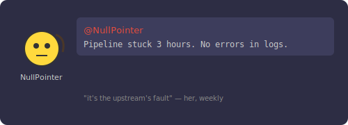
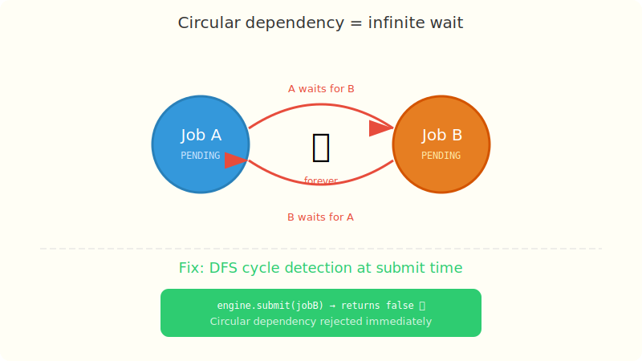

# Chapter 7: The Infinite Wait

[← Chapter 6: The Stuck API Call](part-06-thread-starvation.md) | [Chapter 8: Black Friday →](part-08-backpressure.md)

---

## The Incident

The data team wanted job dependencies.



You built it — Job B waits for Job A to complete before running. Simple check at execution time: are my dependencies done? If not, re-queue and try later.

It works great. Until someone configures two jobs that depend on each other.

> **@NullPointer:** The report pipeline has been stuck for 3 hours. Jobs A and B are both in the queue but neither is executing. No errors in the logs.

NullPointer is the data engineer. She got the nickname because every dataset she touches has unexpected nulls in it. "It's not my fault the upstream is garbage," she says, weekly. But her pipelines are solid — when they're not deadlocked.

You check. Job A depends on Job B. Job B depends on Job A. Both are PENDING. Both keep getting picked up by workers, checked for dependencies, and re-queued. Forever. No error. No crash. Just silence.

## The Solution Attempt — Check Dependencies at Execution Time

The naive approach: when a worker picks up a job, check if its dependencies are done. If not, put it back in the queue and try again later.

```java
private void workerLoop() {
    while (running) {
        Job job = queue.poll(1, TimeUnit.SECONDS);
        if (job == null) continue;

        // Just check at execution time — what could go wrong?
        if (!areDependenciesMet(job)) {
            queue.offer(job);  // re-queue, try later
            continue;
        }

        executeJob(job);
    }
}
```

No validation at submission time. No cycle detection. Just "try it and see."

## The Failing Test

```java
@Test
void circularDependencyShouldNotHangTheEngine() throws InterruptedException {
    // A depends on B, B depends on A
    Job a = new Job("A", "job-a", JobPriority.NORMAL,
            Duration.ofSeconds(5), () -> {}, List.of("B"));
    Job b = new Job("B", "job-b", JobPriority.NORMAL,
            Duration.ofSeconds(5), () -> {}, List.of("A"));

    // Without cycle detection, both jobs bounce in the queue forever.
    // The engine never makes progress.
    // We can't even write a clean assertion — it just hangs.

    // What we WANT: reject the circular dependency at submit time
    // assertThat(engine.submit(b)).isFalse();

    // What we GET without the fix: engine.submit(b) returns true,
    // both jobs sit in the queue forever, workers re-queue them
    // endlessly, and the engine is stuck.
}
```

Without cycle detection, both jobs enter the queue. Worker picks up A, checks if B is completed — it's not (B is PENDING). Re-queues A. Worker picks up B, checks if A is completed — it's not. Re-queues B. Forever.

```
Worker: pick A → deps not met → re-queue A
Worker: pick B → deps not met → re-queue B
Worker: pick A → deps not met → re-queue A
Worker: pick B → deps not met → re-queue B
... infinite loop, no progress, no error ...
```

With transitive dependencies it's sneakier: A→B→C→A. Each job only knows about its direct dependency, but the cycle exists three hops away.

## What Happened



The engine has no way to detect that a set of dependencies forms a cycle. It just keeps trying to execute jobs whose dependencies will never be met. The workers are busy (polling, checking, re-queuing) but making zero progress. It's a livelock — worse than a crash because there's no error to alert on.

## The Fix — DFS Cycle Detection Before Submission

We reject circular dependencies at submission time, before the job enters the queue. A depth-first search walks the dependency graph looking for back edges (cycles).

```java
// src/main/java/com/jobengine/dependency/DependencyResolver.java
package com.jobengine.dependency;

import com.jobengine.model.Job;
import com.jobengine.model.JobStatus;

import java.util.*;
import java.util.concurrent.ConcurrentHashMap;

public class DependencyResolver {

    private final ConcurrentHashMap<String, Job> jobRegistry = new ConcurrentHashMap<>();

    public void register(Job job) {
        jobRegistry.put(job.getId(), job);
    }

    public void remove(String jobId) {
        jobRegistry.remove(jobId);
    }

    /**
     * Returns true if all dependencies of the given job are completed.
     */
    public boolean areDependenciesMet(Job job) {
        for (String depId : job.getDependsOn()) {
            Job dep = jobRegistry.get(depId);
            if (dep == null) continue; // not registered = assume met
            if (dep.getStatus() != JobStatus.COMPLETED) {
                return false;
            }
        }
        return true;
    }

    /**
     * Detects circular dependencies using DFS.
     * Returns true if adding this job would create a cycle.
     */
    public boolean hasCircularDependency(Job job) {
        Set<String> visited = new HashSet<>();
        Set<String> inStack = new HashSet<>();
        return hasCycleDFS(job.getId(), visited, inStack, job);
    }

    private boolean hasCycleDFS(String jobId, Set<String> visited,
                                 Set<String> inStack, Job newJob) {
        if (inStack.contains(jobId)) return true;  // cycle!
        if (visited.contains(jobId)) return false;

        visited.add(jobId);
        inStack.add(jobId);

        List<String> deps = jobId.equals(newJob.getId())
                ? newJob.getDependsOn()
                : Optional.ofNullable(jobRegistry.get(jobId))
                    .map(Job::getDependsOn).orElse(List.of());

        for (String depId : deps) {
            if (hasCycleDFS(depId, visited, inStack, newJob)) {
                return true;
            }
        }

        inStack.remove(jobId);
        return false;
    }

    public Job getJob(String id) { return jobRegistry.get(id); }
}
```

## How the DFS Works

The algorithm maintains two sets:
- `visited`: nodes we've fully explored (all descendants checked)
- `inStack`: nodes on the current recursion path

If we encounter a node that's already in `inStack`, we've found a back edge — a cycle.

```
A → B → C → A   (inStack = {A, B, C}, then we see A again → cycle!)
A → B → C → D   (inStack = {A, B, C, D}, no revisit → no cycle)
```

In the engine's `submit()` method, we check before accepting the job:

```java
public boolean submit(Job job) {
    if (dependencyResolver.hasCircularDependency(job)) {
        log.warn("Circular dependency detected for job {}", job.getId());
        return false;  // rejected — caller knows immediately
    }
    // ... proceed with submission
}
```

## Why ConcurrentHashMap?

The job registry is read during cycle detection (which happens on the submitting thread) and written during registration. `ConcurrentHashMap` provides:
- Lock-free reads (no blocking)
- Segment-level locking for writes (minimal contention)
- Happens-before guarantees between put and get

## The Test That Proves the Fix

```java
// src/test/java/com/jobengine/dependency/DependencyResolverTest.java
package com.jobengine.dependency;

import com.jobengine.model.Job;
import com.jobengine.model.JobPriority;
import com.jobengine.model.JobStatus;
import org.junit.jupiter.api.Test;

import java.time.Duration;
import java.util.List;

import static org.assertj.core.api.Assertions.assertThat;

class DependencyResolverTest {

    private Job job(String id, List<String> deps) {
        return new Job(id, "job-" + id, JobPriority.NORMAL,
                Duration.ofSeconds(5), () -> {}, deps);
    }

    @Test
    void shouldDetectCircularDependency() {
        DependencyResolver resolver = new DependencyResolver();
        Job a = job("A", List.of("B"));
        Job b = job("B", List.of("A")); // A→B→A = cycle
        resolver.register(a);

        // ✅ PASSES — circular dependency detected and rejected
        assertThat(resolver.hasCircularDependency(b)).isTrue();
    }

    @Test
    void shouldAllowLinearDependencies() {
        DependencyResolver resolver = new DependencyResolver();
        Job a = job("A", List.of());
        Job b = job("B", List.of("A"));
        Job c = job("C", List.of("B")); // C→B→A = linear, no cycle
        resolver.register(a);
        resolver.register(b);

        assertThat(resolver.hasCircularDependency(c)).isFalse();
    }

    @Test
    void shouldDetectTransitiveCycle() {
        DependencyResolver resolver = new DependencyResolver();
        Job a = job("A", List.of("C"));
        Job b = job("B", List.of("A"));
        Job c = job("C", List.of("B")); // C→B→A→C = cycle three hops away
        resolver.register(a);
        resolver.register(b);

        assertThat(resolver.hasCircularDependency(c)).isTrue();
    }

    @Test
    void shouldCheckDependenciesMet() {
        DependencyResolver resolver = new DependencyResolver();
        Job dep = job("dep1", List.of());
        resolver.register(dep);
        Job dependent = job("main", List.of("dep1"));
        resolver.register(dependent);

        assertThat(resolver.areDependenciesMet(dependent)).isFalse();

        dep.transitionTo(JobStatus.PENDING, JobStatus.RUNNING);
        dep.transitionTo(JobStatus.RUNNING, JobStatus.COMPLETED);

        assertThat(resolver.areDependenciesMet(dependent)).isTrue();
    }

    @Test
    void shouldHandleNoDependencies() {
        DependencyResolver resolver = new DependencyResolver();
        Job job = job("solo", List.of());
        assertThat(resolver.areDependenciesMet(job)).isTrue();
        assertThat(resolver.hasCircularDependency(job)).isFalse();
    }
}
```

```bash
./gradlew test --tests "com.jobengine.dependency.DependencyResolverTest"
```

Circular dependency? Rejected at submit time. The caller gets `false` immediately. No hanging, no livelock, no silent failure.

NullPointer reconfigures the pipeline. "It told me right away that the dependency was circular. That's way better than silently hanging for 3 hours." She pauses. "Also, the upstream data has nulls again, but that's a different problem."

Your engine is getting solid. But then comes Black Friday...

---

[← Chapter 6: The Stuck API Call](part-06-thread-starvation.md) | [Chapter 8: Black Friday →](part-08-backpressure.md)