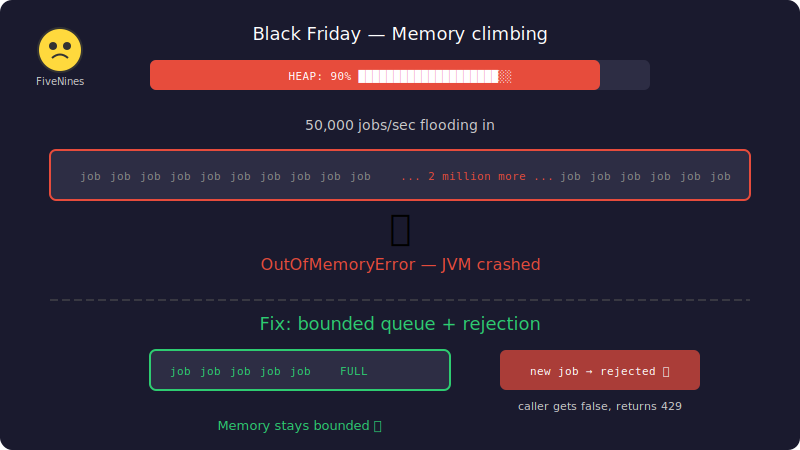

# Chapter 8: Black Friday

[← Chapter 7: The Infinite Wait](part-07-deadlocks.md) | [Chapter 9: The Vanishing Connections →](part-09-resource-exhaustion.md)

---

## The Incident

Black Friday. Traffic spikes 50x. Every purchase triggers a receipt job, an inventory update, a notification. Jobs are flooding in faster than your 4 workers can handle.

> **@FiveNines:** Memory usage is climbing. 70%... 80%... 90%...

FiveNines is live-narrating the death of your server like a nature documentary.

Then the JVM crashes. `OutOfMemoryError`.



The entire application — not just the engine, everything running in that JVM — is dead.

You restart. It crashes again in 20 minutes. The queue was holding 2 million jobs in memory, each with a `Runnable`, a dependency list, strings. The heap couldn't take it.

## The Solution Attempt — Unbounded Queue (Just Keep Accepting)

```java
// No size limit — accept everything
private final PriorityBlockingQueue<Job> queue = new PriorityBlockingQueue<>();

public boolean submit(Job job) {
    queue.offer(job);  // always succeeds, queue grows forever
    return true;
}
```

`PriorityBlockingQueue` is unbounded by default. `offer()` never returns false. The queue will grow until the JVM runs out of memory.

## The Failing Test

```java
@Test
void unboundedQueueShouldNotGrowForever() throws InterruptedException {
    // Engine with 0 workers — nothing drains the queue
    // No max queue size — unbounded
    PriorityBlockingQueue<Job> unboundedQueue = new PriorityBlockingQueue<>();

    // Submit 10,000 jobs with no workers to process them
    for (int i = 0; i < 10_000; i++) {
        unboundedQueue.offer(new Job("job-" + i, "spam", JobPriority.LOW,
                Duration.ofSeconds(10), () -> {}, null));
    }

    // Queue accepted all 10,000 — no rejection, no backpressure
    assertThat(unboundedQueue.size()).isEqualTo(10_000);

    // In production with millions of jobs, this → OutOfMemoryError
    // We WANT the 6th job to be rejected when capacity is 5
    // But unbounded queue says "sure, I'll take it all"
}
```

The queue happily holds 10,000 jobs. In production, that number could be millions. Each `Job` object consumes memory — the task `Runnable`, the dependency list, the strings. Multiply by millions and you're looking at gigabytes of heap consumed by a queue that will never be drained fast enough.

## What Happened

The **unbounded producer-consumer problem**: producers submit faster than consumers can process. Without a bound, the buffer between them grows without limit.

```
Producers: ████████████████████ (50,000 jobs/sec)
Workers:   ████ (200 jobs/sec)
Queue:     [■■■■■■■■■■■■■■■■■■■■■■■■■■■■■■■■■■■■■■■■■■■■■■■■■■...]
                                                    ↑
                                              growing forever → OOM
```

There's no feedback mechanism telling producers to slow down. The queue absorbs everything until the system collapses.

## The Fix — Bounded Queue Size with Rejection

Add a `maxQueueSize` to the engine. When the queue is full, `submit()` returns `false`. The caller decides what to do — retry, drop, buffer externally, or return HTTP 429.

```java
// In the engine's submit() method
public boolean submit(Job job) {
    if (!running) return false;

    // Part 7: Deadlock detection
    if (dependencyResolver.hasCircularDependency(job)) {
        return false;
    }

    // Part 8: Backpressure — reject when full
    if (queue.size() >= maxQueueSize) {
        log.warn("Queue full, rejecting job {}", job.getId());
        return false;
    }

    dependencyResolver.register(job);
    queue.offer(job);
    metrics.recordSubmitted();
    return true;
}
```

We check `queue.size()` manually because `PriorityBlockingQueue` doesn't support a native capacity bound (we need it for priority ordering from Part 5). This is a pragmatic trade-off — priority ordering AND backpressure, with a manual size check.

The caller gets clear feedback:

```java
boolean accepted = engine.submit(job);
if (!accepted) {
    // Options:
    // 1. Retry with exponential backoff
    // 2. Drop the job and log it
    // 3. Buffer externally (Redis, Kafka)
    // 4. Return HTTP 429 Too Many Requests
}
```

## The Test That Proves the Fix

```java
@Test
void shouldRejectWhenQueueFull() throws InterruptedException {
    // 0 workers = nothing drains the queue
    JobEngine smallEngine = new JobEngine(0, 5);

    for (int i = 0; i < 5; i++) {
        assertThat(smallEngine.submit(new Job("job-" + i, "fill", JobPriority.NORMAL,
                Duration.ofSeconds(10), () -> {}, null))).isTrue();
    }

    // 6th job rejected — queue is full
    Job overflow = new Job("overflow", "overflow", JobPriority.NORMAL,
            Duration.ofSeconds(5), () -> {}, null);
    assertThat(smallEngine.submit(overflow)).isFalse();

    smallEngine.shutdownNow();
}
```

```bash
./gradlew test --tests "com.jobengine.engine.JobEngineTest.shouldRejectWhenQueueFull"
```

5 jobs accepted. 6th rejected. The engine stays healthy, memory stays bounded, and the caller knows immediately that the system is under pressure.

You deploy the fix with `maxQueueSize = 10000`. Black Friday traffic hits again. The queue fills up, starts rejecting, and the API returns 429 Too Many Requests. The load balancer backs off. The engine stays alive. FiveNines buys you a coffee. "99.999%," he whispers, staring at the uptime graph.

But the next week, the database team reports something strange...

---

[← Chapter 7: The Infinite Wait](part-07-deadlocks.md) | [Chapter 9: The Vanishing Connections →](part-09-resource-exhaustion.md)