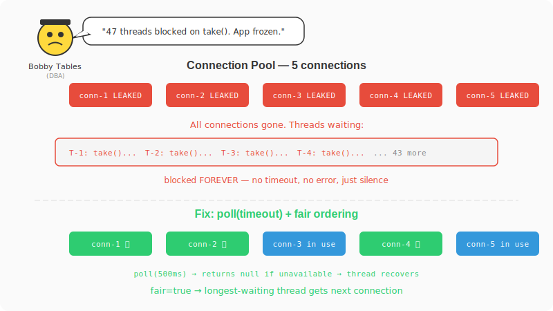

# Chapter 9: The Vanishing Connections

[← Chapter 8: Black Friday](part-08-backpressure.md) | [Chapter 10: You Ship It →](part-10-full-engine.md)

---

## The Incident

Tuesday. The app freezes. No crash, no error, no OOM. Just... stops responding.


> **@BobbyTables:** All 5 database connections are acquired but none are being released. I see 47 threads blocked on `pool.take()`. The app is frozen.

Bobby Tables is the DBA. Yes, named after the [xkcd comic](https://xkcd.com/327/). His parents actually named him Robert, but after the incident in college where he accidentally dropped a production table during a demo, the nickname stuck. He knows more about connection pools than anyone should.

You check the code. A job acquired a DB connection, threw an exception halfway through, and the `release()` call in the `finally` block was missing. The connection leaked. Then another leaked. Then all 5 were gone. Every subsequent thread that tried to acquire a connection called `take()` — which blocks forever.

## The Solution Attempt — Unbounded Pool with Blocking `take()`

```java
public class NaiveResourcePool<T> {
    private final ArrayBlockingQueue<T> pool;

    public NaiveResourcePool(int size, Supplier<T> factory) {
        this.pool = new ArrayBlockingQueue<>(size);
        for (int i = 0; i < size; i++) {
            pool.offer(factory.get());
        }
    }

    public T acquire() throws InterruptedException {
        return pool.take();  // ← blocks FOREVER if pool is empty
    }

    public void release(T resource) {
        pool.offer(resource);
    }
}
```

`take()` blocks until a resource is available. If all resources are acquired and one leaks (acquired but never released due to an exception), the pool shrinks permanently. Eventually all resources are leaked, and every thread calling `acquire()` blocks forever.

## The Failing Test

```java
@Test
void acquireShouldNotBlockForever() throws InterruptedException {
    // Pool with 1 resource
    ArrayBlockingQueue<String> naivePool = new ArrayBlockingQueue<>(1);
    naivePool.offer("connection-1");

    // Acquire the only resource
    String r1 = naivePool.take();
    assertThat(r1).isNotNull();

    // Now the pool is empty. Next acquire blocks forever.
    // We use a thread + join(timeout) to prove it hangs.
    AtomicReference<String> result = new AtomicReference<>();
    Thread blocked = new Thread(() -> {
        try {
            result.set(naivePool.take());  // blocks forever!
        } catch (InterruptedException e) {
            Thread.currentThread().interrupt();
        }
    });

    blocked.start();
    blocked.join(200);  // wait 200ms max

    // FAILS — thread is still alive (blocked on take), result is null
    assertThat(blocked.isAlive()).isTrue();  // still stuck!
    assertThat(result.get()).isNull();       // never got a resource

    blocked.interrupt();  // clean up
}
```

The thread is stuck on `take()` with no way out. In production, this happens when:
- A job acquires a connection, throws an exception, and the `release()` in the `finally` block is missing
- The connection object itself becomes corrupted and is never returned
- A slow query holds a connection for minutes while others pile up waiting

One leaked resource = one permanently blocked thread. Five leaked resources = five permanently blocked threads. Eventually your entire thread pool is frozen.

## What Happened



`take()` has no timeout. It's a promise: "I will wait until a resource is available, no matter how long." If the resource never comes back, the thread waits forever. There's no error, no exception, no log message. Just silence.

```
Thread-1: acquired connection-1, threw exception, forgot to release → LEAKED
Thread-2: pool.take() → waiting...
Thread-3: pool.take() → waiting...
Thread-4: pool.take() → waiting...
...
Thread-50: pool.take() → waiting...

All 50 threads blocked. App is frozen. No error in logs.
```

## The Fix — BoundedResourcePool with `poll(timeout)` + Fair Ordering

```java
// src/main/java/com/jobengine/pool/BoundedResourcePool.java
package com.jobengine.pool;

import java.util.concurrent.ArrayBlockingQueue;
import java.util.concurrent.TimeUnit;
import java.util.function.Supplier;

public class BoundedResourcePool<T> {

    private final ArrayBlockingQueue<T> pool;
    private final int maxSize;

    public BoundedResourcePool(int maxSize, Supplier<T> factory) {
        this.maxSize = maxSize;
        // fair=true ensures FIFO ordering among waiting threads
        this.pool = new ArrayBlockingQueue<>(maxSize, true);
        for (int i = 0; i < maxSize; i++) {
            pool.offer(factory.get());
        }
    }

    public T acquire(long timeoutMs) throws InterruptedException {
        return pool.poll(timeoutMs, TimeUnit.MILLISECONDS);
    }

    public void release(T resource) {
        if (resource != null) {
            pool.offer(resource);
        }
    }

    public int available() { return pool.size(); }
    public int getMaxSize() { return maxSize; }
}
```

## Key Design Decisions

**`poll()` with timeout instead of `take()`:** `poll()` returns `null` after the timeout. The caller can handle it — retry, fail fast, or degrade gracefully. No thread is stuck forever.

**`fair=true`:** Without fairness, `ArrayBlockingQueue` uses a non-fair `ReentrantLock`. Under contention, a thread that just released a resource could immediately re-acquire it (barging), starving other waiting threads. `fair=true` enforces FIFO ordering — the thread that's been waiting longest gets the resource next.

**`Supplier<T> factory`:** Resources are created at pool construction time. The pool is pre-filled and ready to go.

## The Test That Proves the Fix

```java
// src/test/java/com/jobengine/pool/BoundedResourcePoolTest.java
package com.jobengine.pool;

import org.junit.jupiter.api.Test;

import java.util.concurrent.CountDownLatch;
import java.util.concurrent.Executors;
import java.util.concurrent.atomic.AtomicInteger;

import static org.assertj.core.api.Assertions.assertThat;

class BoundedResourcePoolTest {

    @Test
    void shouldAcquireAndRelease() throws InterruptedException {
        BoundedResourcePool<String> pool = new BoundedResourcePool<>(3, () -> "resource");

        assertThat(pool.available()).isEqualTo(3);
        String r1 = pool.acquire(100);
        assertThat(r1).isEqualTo("resource");
        assertThat(pool.available()).isEqualTo(2);

        pool.release(r1);
        assertThat(pool.available()).isEqualTo(3);
    }

    @Test
    void shouldTimeoutWhenExhausted() throws InterruptedException {
        BoundedResourcePool<String> pool = new BoundedResourcePool<>(1, () -> "r");

        String r1 = pool.acquire(100);
        assertThat(r1).isNotNull();

        // ✅ Pool is empty — returns null after timeout instead of blocking forever
        String r2 = pool.acquire(50);
        assertThat(r2).isNull();

        pool.release(r1);

        // Now available again
        String r3 = pool.acquire(100);
        assertThat(r3).isNotNull();
    }

    @Test
    void shouldHandleConcurrentAccessWithoutLeaks() throws InterruptedException {
        int poolSize = 5;
        BoundedResourcePool<Integer> pool = new BoundedResourcePool<>(poolSize, () -> 1);
        int threads = 50;
        int opsPerThread = 100;
        CountDownLatch latch = new CountDownLatch(threads);
        AtomicInteger successCount = new AtomicInteger(0);

        try (var executor = Executors.newVirtualThreadPerTaskExecutor()) {
            for (int i = 0; i < threads; i++) {
                executor.submit(() -> {
                    try {
                        for (int j = 0; j < opsPerThread; j++) {
                            Integer resource = pool.acquire(1000);
                            if (resource != null) {
                                successCount.incrementAndGet();
                                Thread.sleep(1); // simulate work
                                pool.release(resource);
                            }
                        }
                    } catch (InterruptedException e) {
                        Thread.currentThread().interrupt();
                    } finally {
                        latch.countDown();
                    }
                });
            }
            latch.await();
        }

        // ✅ All resources returned — no leaks
        assertThat(pool.available()).isEqualTo(poolSize);
        assertThat(successCount.get()).isEqualTo(threads * opsPerThread);
    }
}
```

```bash
./gradlew test --tests "com.jobengine.pool.BoundedResourcePoolTest"
```

50 threads, 5 resources, 100 operations each. Every resource acquired is released. Pool ends with all 5 resources available. No leaks, no hangs, no silent failures.

Bobby Tables reviews the pool implementation. "Fair ordering and timeout. Nice." He pauses. "You know, I once saw a connection pool leak take down an entire bank for 6 hours. No errors in the logs. Just silence." You fix the leaked connection bug too — proper `try/finally` around every acquire. The app stops freezing.

Linus calls you into a meeting. "The engine has been running in production for two months. Nine incidents, nine fixes. I think it's time to clean it up and ship the final version."

---

[← Chapter 8: Black Friday](part-08-backpressure.md) | [Chapter 10: You Ship It →](part-10-full-engine.md)