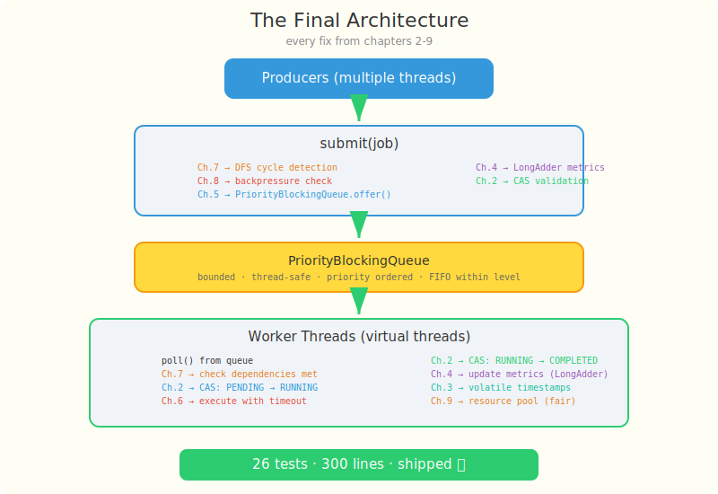

# Chapter 10: You Ship It

[← Chapter 9: The Vanishing Connections](part-09-resource-exhaustion.md) | [Chapter 11: Ship It to the Cloud →](part-11-deployment.md)

---

## The Final Version

Two months. Nine incidents. Nine fixes. Each one taught you something about concurrency that no textbook could:

- A double charge taught you CAS (Chapter 2)
- A stale dashboard taught you volatile (Chapter 3)
- Missing metrics taught you LongAdder (Chapter 4)
- A late fraud alert taught you priority queues (Chapter 5)
- A stuck API taught you timeouts (Chapter 6)
- An infinite wait taught you cycle detection (Chapter 7)
- A Black Friday crash taught you backpressure (Chapter 8)
- Vanishing connections taught you fair resource pools (Chapter 9)

Now you combine every fix into the final engine. The comments in the code point back to the chapter where you learned why.

## The Architecture



```
Producers (multiple threads)
    │
    ▼
┌──────────────────────────────────────┐
│  submit(job)                         │
│  ├── Circular dependency check (DFS) │
│  ├── Backpressure check (queue size) │
│  └── PriorityBlockingQueue.offer()   │
└──────────────┬───────────────────────┘
               │
               ▼
┌──────────────────────────────────────┐
│  PriorityBlockingQueue               │
│  (bounded, thread-safe, priority     │
│   ordered, FIFO within same level)   │
└──────────────┬───────────────────────┘
               │
               ▼
┌──────────────────────────────────────┐
│  Worker Threads (virtual threads)    │
│  ├── poll() from queue               │
│  ├── Check dependencies met          │
│  ├── CAS: PENDING → RUNNING         │
│  ├── Execute with timeout            │
│  ├── CAS: RUNNING → COMPLETED/FAILED│
│  └── Update metrics (LongAdder)      │
└──────────────────────────────────────┘
```

## The JobEngine

This is where everything comes together. Every concurrency primitive from Parts 2-9 is used here.

```java
// src/main/java/com/jobengine/engine/JobEngine.java
package com.jobengine.engine;

import com.jobengine.dependency.DependencyResolver;
import com.jobengine.metrics.JobMetrics;
import com.jobengine.model.Job;
import com.jobengine.model.JobStatus;
import org.slf4j.Logger;
import org.slf4j.LoggerFactory;

import java.time.Duration;
import java.time.Instant;
import java.util.concurrent.*;

public class JobEngine {

    private static final Logger log = LoggerFactory.getLogger(JobEngine.class);

    private final PriorityBlockingQueue<Job> queue;
    private final ExecutorService workerPool;
    private final ScheduledExecutorService timeoutScheduler;
    private final JobMetrics metrics;
    private final DependencyResolver dependencyResolver;
    private final int maxQueueSize;
    private volatile boolean running = true;

    // Track in-flight jobs for cancellation
    private final ConcurrentHashMap<String, Future<?>> inFlightJobs = new ConcurrentHashMap<>();

    public JobEngine(int workerCount, int maxQueueSize) {
        this.maxQueueSize = maxQueueSize;
        this.queue = new PriorityBlockingQueue<>(maxQueueSize);
        this.workerPool = Executors.newVirtualThreadPerTaskExecutor();
        this.timeoutScheduler = Executors.newScheduledThreadPool(1, r -> {
            Thread t = new Thread(r, "timeout-scheduler");
            t.setDaemon(true);
            return t;
        });
        this.metrics = new JobMetrics();
        this.dependencyResolver = new DependencyResolver();

        // Start worker virtual threads
        for (int i = 0; i < workerCount; i++) {
            Thread.ofVirtual().name("worker-" + i).start(this::workerLoop);
        }
    }

    /**
     * Submit a job. Returns false if rejected (circular dep or queue full).
     */
    public boolean submit(Job job) {
        if (!running) return false;

        // Part 7: Deadlock detection
        if (dependencyResolver.hasCircularDependency(job)) {
            log.warn("Circular dependency detected for job {}", job.getId());
            return false;
        }

        // Part 8: Backpressure
        if (queue.size() >= maxQueueSize) {
            log.warn("Queue full, rejecting job {}", job.getId());
            return false;
        }

        dependencyResolver.register(job);
        queue.offer(job);  // Part 5: PriorityBlockingQueue handles ordering
        metrics.recordSubmitted();  // Part 4: LongAdder — no lost increments
        return true;
    }

    /**
     * Cancel a pending or running job.
     */
    public boolean cancel(String jobId) {
        Job job = dependencyResolver.getJob(jobId);
        if (job == null) return false;

        // Part 2: CAS — only one thread can cancel
        if (job.cancel()) {
            metrics.recordCancelled();
            return true;
        }

        // If already running, interrupt it
        Future<?> future = inFlightJobs.get(jobId);
        if (future != null) {
            future.cancel(true);
            job.transitionTo(JobStatus.RUNNING, JobStatus.CANCELLED);
            metrics.recordCancelled();
            metrics.decrementActive();
            return true;
        }

        return false;
    }

    /**
     * Worker loop — the consumer side of producer-consumer.
     */
    private void workerLoop() {
        while (running) {
            try {
                Job job = queue.poll(1, TimeUnit.SECONDS);
                if (job == null) continue;

                if (job.getStatus() == JobStatus.CANCELLED) continue;

                // Part 7: Check dependencies before executing
                if (!dependencyResolver.areDependenciesMet(job)) {
                    queue.offer(job);  // re-queue
                    Thread.sleep(100); // avoid busy-waiting
                    continue;
                }

                // Part 2: CAS prevents double-execution
                if (!job.transitionTo(JobStatus.PENDING, JobStatus.RUNNING)) {
                    continue;
                }

                executeJob(job);

            } catch (InterruptedException e) {
                Thread.currentThread().interrupt();
                break;
            }
        }
    }

    private void executeJob(Job job) {
        metrics.incrementActive();  // Part 4: AtomicLong for exact count
        job.setStartedAt(Instant.now());  // Part 3: volatile — visible to all threads

        Future<?> future = CompletableFuture.runAsync(job.getTask(), workerPool);
        inFlightJobs.put(job.getId(), future);

        // Part 6: Schedule timeout
        ScheduledFuture<?> timeoutFuture = null;
        if (job.getTimeout() != null && !job.getTimeout().isZero()) {
            timeoutFuture = timeoutScheduler.schedule(() -> {
                if (job.getStatus() == JobStatus.RUNNING) {
                    future.cancel(true);
                    job.transitionTo(JobStatus.RUNNING, JobStatus.TIMED_OUT);
                    job.setCompletedAt(Instant.now());
                    metrics.decrementActive();
                    metrics.recordTimedOut();
                }
            }, job.getTimeout().toMillis(), TimeUnit.MILLISECONDS);
        }

        try {
            future.get();

            if (job.getStatus() == JobStatus.RUNNING) {
                job.transitionTo(JobStatus.RUNNING, JobStatus.COMPLETED);
                job.setCompletedAt(Instant.now());
                long elapsed = Duration.between(
                    job.getStartedAt(), job.getCompletedAt()).toMillis();
                metrics.recordCompleted(elapsed);
            }
        } catch (CancellationException e) {
            // Timeout or manual cancel — already handled
        } catch (ExecutionException e) {
            if (job.getStatus() == JobStatus.RUNNING) {
                job.transitionTo(JobStatus.RUNNING, JobStatus.FAILED);
                job.setFailureReason(e.getCause().getMessage());
                job.setCompletedAt(Instant.now());
                metrics.recordFailed();
            }
        } catch (InterruptedException e) {
            Thread.currentThread().interrupt();
        } finally {
            inFlightJobs.remove(job.getId());
            if (job.getStatus() == JobStatus.RUNNING
                    || job.getStatus() == JobStatus.COMPLETED
                    || job.getStatus() == JobStatus.FAILED) {
                metrics.decrementActive();
            }
            if (timeoutFuture != null) {
                timeoutFuture.cancel(false);
            }
        }
    }

    public void shutdown() {
        running = false;
        workerPool.shutdown();
        timeoutScheduler.shutdown();
    }

    public void shutdownNow() {
        running = false;
        workerPool.shutdownNow();
        timeoutScheduler.shutdownNow();
    }

    public boolean awaitTermination(long timeout, TimeUnit unit)
            throws InterruptedException {
        return workerPool.awaitTermination(timeout, unit);
    }

    public JobMetrics getMetrics() { return metrics; }
    public DependencyResolver getDependencyResolver() { return dependencyResolver; }
    public int getQueueSize() { return queue.size(); }
}
```

## The Full Engine Test Suite (9 Tests)

```java
// src/test/java/com/jobengine/engine/JobEngineTest.java
package com.jobengine.engine;

import com.jobengine.model.Job;
import com.jobengine.model.JobPriority;
import com.jobengine.model.JobStatus;
import org.junit.jupiter.api.*;

import java.time.Duration;
import java.util.ArrayList;
import java.util.Collections;
import java.util.List;
import java.util.concurrent.CountDownLatch;
import java.util.concurrent.TimeUnit;
import java.util.concurrent.atomic.AtomicInteger;

import static org.assertj.core.api.Assertions.assertThat;

class JobEngineTest {

    private JobEngine engine;

    @BeforeEach
    void setUp() {
        engine = new JobEngine(4, 1000);
    }

    @AfterEach
    void tearDown() throws InterruptedException {
        engine.shutdownNow();
        engine.awaitTermination(5, TimeUnit.SECONDS);
    }

    @Test
    void shouldExecuteSimpleJob() throws InterruptedException {
        CountDownLatch latch = new CountDownLatch(1);
        Job job = new Job("1", "simple", JobPriority.NORMAL, Duration.ofSeconds(5),
                latch::countDown, null);

        engine.submit(job);
        assertThat(latch.await(5, TimeUnit.SECONDS)).isTrue();

        Thread.sleep(100);
        assertThat(job.getStatus()).isEqualTo(JobStatus.COMPLETED);
        assertThat(engine.getMetrics().getCompleted()).isEqualTo(1);
    }

    @Test
    void shouldHandleFailingJob() throws InterruptedException {
        CountDownLatch latch = new CountDownLatch(1);
        Job job = new Job("1", "failing", JobPriority.NORMAL, Duration.ofSeconds(5),
                () -> { latch.countDown(); throw new RuntimeException("Boom"); }, null);

        engine.submit(job);
        assertThat(latch.await(5, TimeUnit.SECONDS)).isTrue();

        Thread.sleep(200);
        assertThat(job.getStatus()).isEqualTo(JobStatus.FAILED);
        assertThat(job.getFailureReason()).isEqualTo("Boom");
    }

    @Test
    void shouldProcessHighPriorityFirst() throws InterruptedException {
        CountDownLatch blocker = new CountDownLatch(1);

        // Block all 4 workers
        for (int i = 0; i < 4; i++) {
            engine.submit(new Job("blocker-" + i, "block", JobPriority.LOW,
                Duration.ofSeconds(10), () -> {
                    try { blocker.await(); }
                    catch (InterruptedException e) { Thread.currentThread().interrupt(); }
                }, null));
        }
        Thread.sleep(200);

        // Queue jobs in reverse priority order
        List<String> executionOrder = Collections.synchronizedList(new ArrayList<>());
        CountDownLatch done = new CountDownLatch(3);

        engine.submit(new Job("low", "low", JobPriority.LOW, Duration.ofSeconds(5),
                () -> { executionOrder.add("LOW"); done.countDown(); }, null));
        engine.submit(new Job("critical", "critical", JobPriority.CRITICAL,
                Duration.ofSeconds(5),
                () -> { executionOrder.add("CRITICAL"); done.countDown(); }, null));
        engine.submit(new Job("high", "high", JobPriority.HIGH, Duration.ofSeconds(5),
                () -> { executionOrder.add("HIGH"); done.countDown(); }, null));

        blocker.countDown();
        assertThat(done.await(10, TimeUnit.SECONDS)).isTrue();

        assertThat(executionOrder.indexOf("CRITICAL"))
                .isLessThan(executionOrder.indexOf("LOW"));
    }

    @Test
    void shouldTimeoutLongRunningJob() throws InterruptedException {
        Job job = new Job("1", "slow", JobPriority.NORMAL, Duration.ofMillis(200),
                () -> {
                    try { Thread.sleep(10000); }
                    catch (InterruptedException e) { Thread.currentThread().interrupt(); }
                }, null);

        engine.submit(job);
        Thread.sleep(500);

        assertThat(job.getStatus()).isEqualTo(JobStatus.TIMED_OUT);
    }

    @Test
    void shouldCancelPendingJob() throws InterruptedException {
        CountDownLatch blocker = new CountDownLatch(1);
        for (int i = 0; i < 4; i++) {
            engine.submit(new Job("blocker-" + i, "block", JobPriority.LOW,
                Duration.ofSeconds(10), () -> {
                    try { blocker.await(); }
                    catch (InterruptedException e) { Thread.currentThread().interrupt(); }
                }, null));
        }
        Thread.sleep(200);

        Job cancelMe = new Job("cancel", "cancel", JobPriority.NORMAL,
                Duration.ofSeconds(5), () -> {}, null);
        engine.submit(cancelMe);

        assertThat(engine.cancel("cancel")).isTrue();
        assertThat(cancelMe.getStatus()).isEqualTo(JobStatus.CANCELLED);
        blocker.countDown();
    }

    @Test
    void shouldHandleMassiveConcurrentSubmission() throws InterruptedException {
        int totalJobs = 1000;
        CountDownLatch allDone = new CountDownLatch(totalJobs);
        AtomicInteger executedCount = new AtomicInteger(0);

        for (int i = 0; i < totalJobs; i++) {
            engine.submit(new Job("job-" + i, "mass-" + i, JobPriority.NORMAL,
                Duration.ofSeconds(30), () -> {
                    executedCount.incrementAndGet();
                    allDone.countDown();
                }, null));
        }

        assertThat(allDone.await(30, TimeUnit.SECONDS)).isTrue();
        assertThat(executedCount.get()).isEqualTo(totalJobs);
    }

    @Test
    void shouldPreventDoubleExecution() throws InterruptedException {
        AtomicInteger executionCount = new AtomicInteger(0);
        Job job = new Job("1", "test", JobPriority.NORMAL,
                Duration.ofSeconds(5), () -> {}, null);

        int threads = 100;
        CountDownLatch latch = new CountDownLatch(threads);

        try (var executor = java.util.concurrent.Executors
                .newVirtualThreadPerTaskExecutor()) {
            for (int i = 0; i < threads; i++) {
                executor.submit(() -> {
                    if (job.transitionTo(JobStatus.PENDING, JobStatus.RUNNING)) {
                        executionCount.incrementAndGet();
                    }
                    latch.countDown();
                });
            }
            latch.await();
        }

        // Exactly 1 thread wins the CAS
        assertThat(executionCount.get()).isEqualTo(1);
    }

    @Test
    void shouldRejectCircularDependency() {
        Job a = new Job("A", "a", JobPriority.NORMAL, Duration.ofSeconds(5),
                () -> {}, List.of("B"));
        Job b = new Job("B", "b", JobPriority.NORMAL, Duration.ofSeconds(5),
                () -> {}, List.of("A"));

        engine.submit(a);
        assertThat(engine.submit(b)).isFalse();
    }

    @Test
    void shouldRejectWhenQueueFull() throws InterruptedException {
        JobEngine smallEngine = new JobEngine(0, 5);

        for (int i = 0; i < 5; i++) {
            assertThat(smallEngine.submit(new Job("job-" + i, "fill",
                JobPriority.NORMAL, Duration.ofSeconds(10), () -> {}, null))).isTrue();
        }

        Job overflow = new Job("overflow", "overflow", JobPriority.NORMAL,
                Duration.ofSeconds(5), () -> {}, null);
        assertThat(smallEngine.submit(overflow)).isFalse();

        smallEngine.shutdownNow();
    }
}
```

## Run All 26 Tests

```bash
./gradlew test
```

Green. All 26. You push the final commit.

Linus reviews the PR. "300 lines of production code. 26 tests. Every concurrency primitive in `java.util.concurrent` used for a reason." He approves.

You're not an intern anymore.

---

[← Chapter 9: The Vanishing Connections](part-09-resource-exhaustion.md) | [Chapter 11: Ship It to the Cloud →](part-11-deployment.md)
