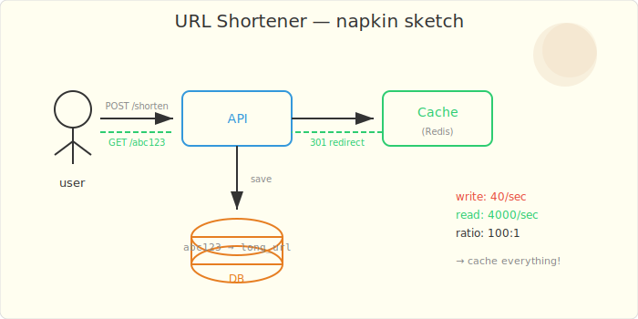
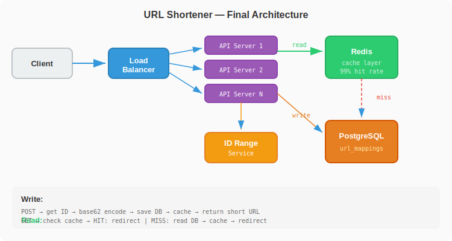

# Chapter 1: The URL That Pointed to Two Places

*In which you build a URL shortener and discover that short things can cause long problems.*

---

## The Task

Three months into the job. You've survived the job engine and the bank transfer service. Linus has a new project.

"Marketing wants a URL shortener. Like bit.ly but ours. Short links for campaigns. Should be simple."

You've learned not to trust that word.

"How much traffic?"

"100 million links created per month. 10 billion redirects. Oh, and it needs to be fast. Sub-10ms redirects."

He walks away. You open a napkin.

## The Napkin Design



The basic idea is dead simple:

1. User submits a long URL
2. System generates a short code (e.g., `abc123`)
3. System stores the mapping: `abc123 → https://example.com/very/long/url`
4. When someone visits `short.ly/abc123`, redirect to the long URL

```
POST /shorten { url: "https://example.com/long" }
  → generates "abc123"
  → stores mapping
  → returns "https://short.ly/abc123"

GET /abc123
  → looks up "abc123"
  → 301 redirect to "https://example.com/long"
```

## The Naive Implementation

You pick the simplest approach: hash the URL, take the first 7 characters, store it.

```java
@Service
public class UrlShortenerService {

    private final UrlMappingRepository repository;

    public String shorten(String longUrl) {
        String hash = DigestUtils.md5DigestAsHex(
            longUrl.getBytes(StandardCharsets.UTF_8));
        String shortCode = hash.substring(0, 7);

        UrlMapping mapping = new UrlMapping(shortCode, longUrl);
        repository.save(mapping);

        return shortCode;
    }

    public String resolve(String shortCode) {
        return repository.findById(shortCode)
            .map(UrlMapping::getLongUrl)
            .orElseThrow(() -> new NotFoundException("URL not found"));
    }
}
```

You write a test. It works.

```java
@Test
void shouldShortenAndResolve() {
    String code = service.shorten("https://example.com/very/long/url");
    String resolved = service.resolve(code);
    assertThat(resolved).isEqualTo("https://example.com/very/long/url");
}
```

Green. Ship it.

## The Incident

Two weeks later. Marketing runs a campaign. TicketMaster pings you:

> **@TicketMaster:** Two different campaign URLs are returning the same short link. Campaign A's link redirects to Campaign B's page. Marketing is furious.

You check the database. Two different long URLs generated the same 7-character hash prefix. A **hash collision**.

MD5 produces 128-bit hashes. You're using 7 hex characters = 28 bits = ~268 million possible values. With 100 million URLs per month, the birthday paradox kicks in fast. Collisions are inevitable.

## The Failing Test

```java
@Test
void differentUrlsShouldNotCollide() {
    // These two URLs happen to share the same MD5 prefix
    String code1 = service.shorten("https://campaign-a.com/spring-sale");
    String code2 = service.shorten("https://campaign-b.com/summer-sale");

    // FAILS — both get the same short code, second overwrites first
    assertThat(code1).isNotEqualTo(code2);
}
```

## The Real Design

Three problems to solve: collision handling, efficient encoding, and read-heavy caching.

### Problem 1: Collisions — Use a Counter, Not a Hash

Instead of hashing (which collides), use a globally unique counter and encode it in base62:

```java
@Service
public class UrlShortenerService {

    private final AtomicLong counter = new AtomicLong(100000); // start above 0
    private final UrlMappingRepository repository;
    private final RedisTemplate<String, String> cache;

    private static final String BASE62 =
        "0123456789abcdefghijklmnopqrstuvwxyzABCDEFGHIJKLMNOPQRSTUVWXYZ";

    public String shorten(String longUrl) {
        // Check if URL already shortened (dedup)
        var existing = repository.findByLongUrl(longUrl);
        if (existing.isPresent()) {
            return existing.get().getShortCode();
        }

        long id = counter.incrementAndGet();
        String shortCode = toBase62(id);

        repository.save(new UrlMapping(shortCode, longUrl));
        cache.opsForValue().set(shortCode, longUrl, 24, TimeUnit.HOURS);

        return shortCode;
    }

    public String resolve(String shortCode) {
        // Check cache first (99% of reads)
        String cached = cache.opsForValue().get(shortCode);
        if (cached != null) return cached;

        // Cache miss — hit DB
        return repository.findById(shortCode)
            .map(mapping -> {
                cache.opsForValue().set(shortCode, mapping.getLongUrl(),
                    24, TimeUnit.HOURS);
                return mapping.getLongUrl();
            })
            .orElseThrow(() -> new NotFoundException("URL not found"));
    }

    static String toBase62(long num) {
        StringBuilder sb = new StringBuilder();
        while (num > 0) {
            sb.append(BASE62.charAt((int)(num % 62)));
            num /= 62;
        }
        return sb.reverse().toString();
    }
}
```

Base62 encoding: 7 characters = 62^7 = **3.5 trillion** possible codes. At 100M/month, that's 35,000 years before exhaustion. No collisions ever — each counter value is unique.

### Problem 2: Read-Heavy — Cache Everything

10 billion redirects vs 100 million creates = 100:1 read-to-write ratio. Perfect for caching.



```
Write path:
  POST /shorten → generate base62 code → write DB → write cache → return

Read path (99.9% of traffic):
  GET /{code} → check cache → HIT → 301 redirect (sub-1ms)
                            → MISS → read DB → populate cache → redirect
```

### Problem 3: Distributed Counter

A single `AtomicLong` doesn't work across multiple servers. Options:

| Approach | Pros | Cons |
|----------|------|------|
| Database sequence | Simple, no coordination | DB bottleneck at scale |
| Redis INCR | Fast, atomic | Single point of failure |
| Snowflake ID | No coordination needed | 64-bit, longer codes |
| Pre-allocated ranges | Each server gets a range (1-1M, 1M-2M, ...) | Gaps in sequence |

For our scale, **pre-allocated ranges** work well. Each server requests a block of 10,000 IDs from a coordination service. No per-request coordination needed.

## The Lesson

> **Never use hash truncation for unique identifiers.** The birthday paradox guarantees collisions far sooner than you'd expect. Use monotonic counters with efficient encoding instead.

## Key Numbers

| Metric | Value |
|--------|-------|
| Short code length | 7 characters (base62) |
| Possible codes | 3.5 trillion |
| Write throughput | 100M/month (~40/sec) |
| Read throughput | 10B/month (~4000/sec) |
| Cache hit ratio | 99%+ (hot URLs) |
| Redirect latency | <10ms (cache hit) |

NullPointer walks by your desk. "Nice URL shortener. But we're getting hammered by a bot that's hitting the API 10 million times a minute. Can you add rate limiting?"

---

*Next: [Chapter 2 — The Bot That Killed the API](ch02-rate-limiter.md)*
