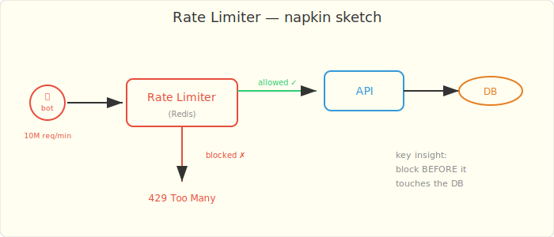
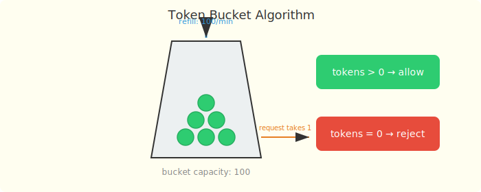
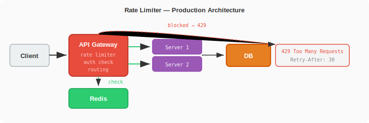

# Chapter 2: The Bot That Killed the API

*In which you learn that not all traffic is friendly, and saying "no" is a feature.*

---

## The Incident

Your URL shortener is live. Traffic is growing. Then one Monday morning:

> **@FiveNines:** API latency went from 5ms to 30 seconds. Database CPU at 100%. Something is hammering us.

You check the access logs. One IP address. 10 million requests in the last 60 seconds. A bot is brute-forcing short URLs — trying every possible code to find valid links.

Your API has no rate limiting. Every request hits the cache, and on cache miss, hits the database. The bot is generating cache misses for codes that don't exist, and every miss goes to the database.

> **@ZeroTrust:** I told you we needed rate limiting. I filed that ticket three weeks ago.

He did. You ignored it. TicketMaster has the receipt.

## The Napkin Design



The idea: before processing any request, check if this client has exceeded their limit. If yes, return `429 Too Many Requests`. If no, let it through.

```
Request → Rate Limiter → allowed? → yes → API → response
                                  → no  → 429 Too Many Requests
```

The question is: how do you count requests efficiently at 100,000+ per second?

## The Naive Implementation — In-Memory Counter

```java
@Component
public class NaiveRateLimiter {

    // userId → request count
    private final ConcurrentHashMap<String, AtomicInteger> counters =
        new ConcurrentHashMap<>();
    private final ConcurrentHashMap<String, Long> windowStart =
        new ConcurrentHashMap<>();

    private static final int MAX_REQUESTS = 100;
    private static final long WINDOW_MS = 60_000; // 1 minute

    public boolean isAllowed(String userId) {
        long now = System.currentTimeMillis();
        windowStart.putIfAbsent(userId, now);
        counters.putIfAbsent(userId, new AtomicInteger(0));

        long start = windowStart.get(userId);

        // Reset window if expired
        if (now - start > WINDOW_MS) {
            windowStart.put(userId, now);
            counters.get(userId).set(0);
        }

        return counters.get(userId).incrementAndGet() <= MAX_REQUESTS;
    }
}
```

You write a test. It works on one server.

## The Failing Test

```java
@Test
void shouldBlockAfterLimit() {
    NaiveRateLimiter limiter = new NaiveRateLimiter();

    for (int i = 0; i < 100; i++) {
        assertThat(limiter.isAllowed("user-1")).isTrue();
    }

    // 101st request should be blocked
    assertThat(limiter.isAllowed("user-1")).isFalse();
}
```

This passes. But then FiveNines asks: "We have 5 API servers behind a load balancer. The bot hits all 5. Each server has its own counter. The bot gets 500 requests per minute instead of 100."

```
Bot → Load Balancer → Server 1: 100 allowed ✓
                    → Server 2: 100 allowed ✓
                    → Server 3: 100 allowed ✓
                    → Server 4: 100 allowed ✓
                    → Server 5: 100 allowed ✓
                    Total: 500 requests allowed (limit was 100)
```

The in-memory counter doesn't work across servers.

## The Real Design — Token Bucket with Redis

The **token bucket** algorithm: each user has a bucket that holds tokens. Each request consumes one token. Tokens refill at a fixed rate. When the bucket is empty, requests are rejected.



```java
@Component
public class RedisRateLimiter {

    private final RedisTemplate<String, String> redis;

    private static final int MAX_TOKENS = 100;
    private static final int REFILL_RATE = 100; // tokens per minute
    private static final long WINDOW_SECONDS = 60;

    public boolean isAllowed(String userId) {
        String key = "rate:" + userId;
        String countStr = redis.opsForValue().get(key);

        if (countStr == null) {
            // First request — set counter with expiry
            redis.opsForValue().set(key, "1", WINDOW_SECONDS, TimeUnit.SECONDS);
            return true;
        }

        long count = Long.parseLong(countStr);
        if (count >= MAX_TOKENS) {
            return false; // bucket empty
        }

        redis.opsForValue().increment(key);
        return true;
    }
}
```

For production, use a Lua script to make the check-and-increment atomic:

```lua
-- rate_limit.lua (runs atomically on Redis)
local key = KEYS[1]
local limit = tonumber(ARGV[1])
local window = tonumber(ARGV[2])

local current = redis.call('GET', key)
if current and tonumber(current) >= limit then
    return 0  -- rejected
end

current = redis.call('INCR', key)
if tonumber(current) == 1 then
    redis.call('EXPIRE', key, window)
end
return 1  -- allowed
```

### Why Redis?

- Shared state across all API servers — one counter per user, not one per server
- `INCR` is atomic — no race conditions
- `EXPIRE` auto-cleans old entries — no memory leak
- Sub-millisecond latency — doesn't slow down the request path

### Sliding Window vs Fixed Window

The fixed window has an edge case: a user sends 100 requests at 0:59 and 100 more at 1:01. In two seconds, they sent 200 requests — double the limit. The window reset at 1:00 gave them a fresh bucket.

**Sliding window log** fixes this by tracking individual request timestamps:

```java
public boolean isAllowed(String userId) {
    String key = "rate:" + userId;
    long now = System.currentTimeMillis();
    long windowStart = now - WINDOW_MS;

    // Remove old entries
    redis.opsForZSet().removeRangeByScore(key, 0, windowStart);

    // Count requests in current window
    Long count = redis.opsForZSet().zCard(key);
    if (count != null && count >= MAX_TOKENS) {
        return false;
    }

    // Add current request
    redis.opsForZSet().add(key, String.valueOf(now), now);
    redis.expire(key, WINDOW_SECONDS, TimeUnit.SECONDS);
    return true;
}
```

Uses a Redis sorted set. Each request is a member with its timestamp as the score. To check the limit, remove entries older than the window and count what's left. Precise, but uses more memory.

### Which Algorithm to Use?

| Algorithm | Memory | Precision | Complexity |
|-----------|--------|-----------|------------|
| Fixed window counter | Low (1 int per user) | Bursty at edges | Simple |
| Sliding window log | High (1 entry per request) | Exact | Medium |
| Sliding window counter | Medium (2 ints per user) | Good enough | Medium |
| Token bucket | Low (2 values per user) | Smooth | Simple |

For most APIs, **token bucket** or **sliding window counter** is the sweet spot.

## The Architecture



```
Request → API Gateway → Rate Limiter (Redis) → allowed? → API Server
                                              → blocked → 429 + Retry-After header
```

The rate limiter sits in the API gateway or as middleware — before any business logic runs. Blocked requests never touch the database.

## The Lesson

> **Rate limiting is not optional.** Every public API will be abused. The question is when, not if. Put the limiter in front of everything, use shared state (Redis), and return proper `429` responses with `Retry-After` headers so legitimate clients can back off gracefully.

## Key Numbers

| Metric | Value |
|--------|-------|
| Default limit | 100 requests/minute per user |
| Redis latency | <1ms per check |
| Memory per user | ~100 bytes (token bucket) |
| 1M active users | ~100MB Redis memory |

ZeroTrust is satisfied. The bot is blocked. But then NullPointer asks: "Can we build our own cache? Redis is a single point of failure."

You look at her. "Build our own cache?"

"How hard can it be?"

---

*Next: [Chapter 3 — The Cache That Forgot Everything](ch03-kv-store.md)*
