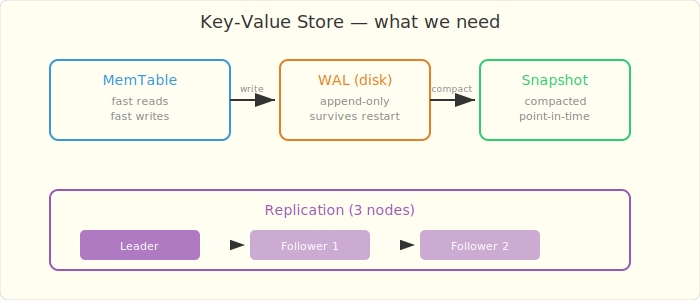
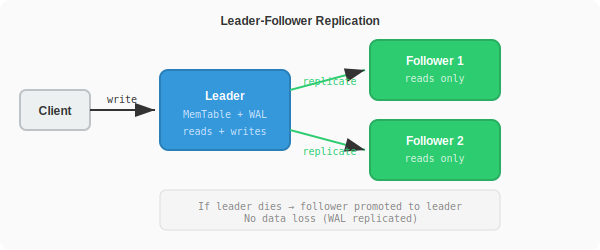
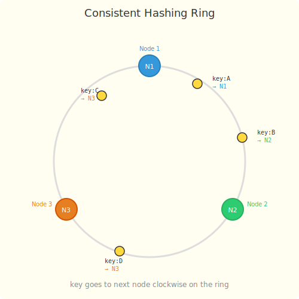

# Chapter 3: The Cache That Forgot Everything

*In which you build a key-value store and learn why "just restart it" is not a recovery strategy.*

---

## The Incident

NullPointer's request seemed reasonable: "Redis is a single point of failure. If it goes down, every request hits the database. Can we build something more resilient?"

You built a simple in-memory key-value store. HashMap with a REST API. Fast, simple, works great.

Then FiveNines restarted the server for a routine patch.

> **@FiveNines:** I restarted the cache server. All 50 million cached entries are gone. Every request is hitting PostgreSQL. Database CPU at 100%. Latency through the roof.

Your in-memory cache had no persistence. When the process died, everything vanished. 50 million requests simultaneously discovered their cache was empty and stampeded to the database. The **thundering herd**.

## The Napkin Design



A real key-value store needs:
1. **Persistence** — survive restarts
2. **Fast reads** — serve from memory
3. **Replication** — survive node failures
4. **Partitioning** — scale beyond one machine

## The Naive Implementation

```java
public class NaiveKVStore {
    private final ConcurrentHashMap<String, String> store =
        new ConcurrentHashMap<>();

    public void put(String key, String value) {
        store.put(key, value);
    }

    public String get(String key) {
        return store.get(key);
    }

    public void delete(String key) {
        store.remove(key);
    }
}
```

Fast. Simple. Loses everything on restart.

## The Failing Test

```java
@Test
void shouldSurviveRestart() {
    NaiveKVStore store = new NaiveKVStore();
    store.put("user:123", "{name: 'Alice'}");

    // Simulate restart
    store = new NaiveKVStore();

    // FAILS — data is gone
    assertThat(store.get("user:123")).isNotNull();
}
```

## The Real Design

### Problem 1: Persistence — Write-Ahead Log (WAL)

Before writing to memory, append the operation to a log file on disk. On restart, replay the log to rebuild the in-memory state.

```java
public class PersistentKVStore {
    private final ConcurrentHashMap<String, String> memTable =
        new ConcurrentHashMap<>();
    private final WriteAheadLog wal;

    public void put(String key, String value) {
        wal.append("PUT", key, value);  // disk first
        memTable.put(key, value);        // then memory
    }

    public String get(String key) {
        return memTable.get(key);  // always from memory — fast
    }

    public void recover() {
        // On startup, replay the WAL
        wal.replay((op, key, value) -> {
            if ("PUT".equals(op)) memTable.put(key, value);
            if ("DEL".equals(op)) memTable.remove(key);
        });
    }
}
```

The WAL is append-only — sequential disk writes are fast (100MB/s+). Reads never touch disk.

### Problem 2: WAL Gets Huge — Compaction

After millions of writes, the WAL file is gigabytes. Most entries are overwritten. Compaction merges the log into a compact snapshot:

```
WAL:
  PUT user:1 "Alice"
  PUT user:2 "Bob"
  PUT user:1 "Alice Updated"   ← overwrites first entry
  DEL user:2                    ← deletes Bob

Compacted snapshot:
  user:1 → "Alice Updated"
```

The snapshot is a point-in-time image. New writes go to a fresh WAL. On restart: load snapshot + replay new WAL.

### Problem 3: One Node Dies — Replication



Run 3 replicas. Writes go to the leader, which replicates to followers. If the leader dies, a follower takes over.

```
Write: Client → Leader → Follower 1 + Follower 2
Read:  Client → any node (leader or follower)
```

### Problem 4: Too Big for One Machine — Consistent Hashing

With 50 million keys, one machine runs out of memory. Partition the keys across N nodes using consistent hashing:

```
hash("user:123") % N → node 2
hash("user:456") % N → node 0
hash("user:789") % N → node 1
```

But naive modulo breaks when you add/remove nodes — every key remaps. **Consistent hashing** minimizes remapping: only K/N keys move when a node is added (K = total keys, N = total nodes).



Virtual nodes smooth out the distribution: each physical node gets 100-200 positions on the ring, preventing hot spots.

## The Architecture

```
Client
  │
  ├── hash(key) → determine which node
  │
  ▼
┌─────────────┐  ┌─────────────┐  ┌─────────────┐
│   Node 1    │  │   Node 2    │  │   Node 3    │
│ keys: A-H   │  │ keys: I-P   │  │ keys: Q-Z   │
│             │  │             │  │             │
│ MemTable    │  │ MemTable    │  │ MemTable    │
│ WAL → disk  │  │ WAL → disk  │  │ WAL → disk  │
│ Snapshot    │  │ Snapshot    │  │ Snapshot    │
│             │  │             │  │             │
│ Replica: N2 │  │ Replica: N3 │  │ Replica: N1 │
└─────────────┘  └─────────────┘  └─────────────┘
```

Each node owns a range of keys, persists to disk via WAL + snapshots, and replicates to one other node for fault tolerance.

## The Lesson

> **In-memory is fast but fragile.** Any system that holds state must answer: "What happens when this process dies?" If the answer is "we lose everything," you need persistence (WAL), redundancy (replication), and a plan for the thundering herd (cache warming, circuit breakers).

## Key Concepts

| Concept | What It Does | Why It Matters |
|---------|-------------|----------------|
| Write-Ahead Log | Persists writes to disk before memory | Survives restarts |
| Compaction | Merges old log entries into snapshots | Keeps disk usage bounded |
| Replication | Copies data to multiple nodes | Survives node failures |
| Consistent Hashing | Distributes keys across nodes | Scales horizontally, minimal remapping |
| Virtual Nodes | Multiple hash positions per physical node | Even distribution |

Bobby Tables walks by. "Nice distributed cache. But what happens when your message queue delivers the same message twice?"

NullPointer groans. "It's the upstream's fault."

---

*Next: [Chapter 4 — The Message That Arrived Twice](ch04-message-queue.md)*
